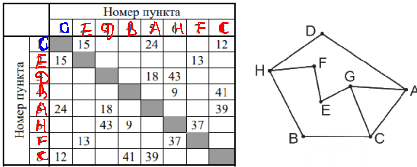

# Анализ задания 1 ЕГЭ по информатике

## Общая информация

* **Номер задания:** 1
* **Уровень сложности:** Базовый
* **Рекомендуемое время:** 3 минуты

## Проверяемые темы и умения

### 1. Кодификатор ЕГЭ (темы)

* **2.10. Модели и моделирование.**
    * Цели моделирования.
    * Адекватность модели моделируемому объекту или процессу.
    * Формализация прикладных задач.
    * Представление результатов моделирования в виде, удобном для восприятия человеком.
    * **Графическое представление данных (схемы, таблицы, графики).**

* **2.1. Умение использовать компьютерно-математические модели для анализа объектов и процессов:**
    * Формулировать цель моделирования.
    * Выполнять анализ результатов, полученных в ходе моделирования.
    * Оценивать адекватность модели моделируемому объекту или процессу.
    * **Представлять результаты моделирования в наглядном виде.**

### 2. Краткое описание задания

**Тема:** Использование и анализ информационных моделей (таблицы, диаграммы, графики).

**Что проверяется:** Умение представлять и считывать данные в разных типах информационных моделей (схемы, карты,
таблицы, графики и формулы).

## Теоретическая основа для решения

### Ключевые понятия: Графы

#### Что такое граф?

* **Граф** — это набор вершин и соединяющих их ребер.
* Для описания графа часто используется **таблица**.

#### Типы матриц для описания графов

1. **Матрица смежности:**
    * Показывает, соединены ли вершины ребром.
    * `1` – ребро есть, `0` – ребра нет.
2. **Весовая матрица (наиболее частый случай в задании):**
    * Показывает вес ребра между вершинами.
    * Пустая клетка или символ (например, `∞`) означает, что ребра нет.

#### Взвешенный граф

* В задании чаще всего используется **взвешенный граф**, где с каждым ребром связано некоторое число (**вес**).
* **Вес** может обозначать:
    * Расстояние между городами.
    * Стоимость перевозки.
    * Время в пути и т.д.

#### Важные нюансы при работе с моделями

* **Неоднозначность графического представления:**
    * Граф по заданной таблице (весовой матрице) может быть нарисован по-разному. Расположение вершин на схеме может не
      совпадать. Важна только **связь между вершинами и веса рёбер**.

* **Симметричность матрицы:**
    * Часто матрица симметрична относительно главной диагонали. Это означает, что вес ребра из `B` в `C` равен весу
      ребра из `C` в `B` (например, длина дороги туда и обратно одинакова).
    * **Внимание!** Это не всегда так (например, если граф моделирует дороги с односторонним движением).

* **Интерпретация веса:**
    * Во многих задачах **вес – это длина дороги** из одного пункта в другой.
    * Пример: Длина дороги из А в С равна 3, дороги из А в Е – нет (соответствующая клетка в таблице пуста).

* **Степень вершины:**
    * **Степень вершины** – это количество рёбер, которые соединены с этой вершиной.
    * **Как определить по таблице:** нужно считать число непустых ячеек весовой матрицы в соответствующей строке (или
      столбце).
    * Пример: В таблице ниже степень вершины `А` равна 2 (в первой строке две непустых ячейки со значениями 3 и 1).

#### Связь между графическим представлением и таблицей

Рассмотрим пример:

* **Графическое представление** (схема графа):
  ```
    A --2-- B
    |       | \
    |       |   \
    1       4    5
    |       |     \
    |       |       \
    D---3-- C --6--- E
  ```

* **Табличное представление** (Весовая матрица):

  |       | **A** | **B** | **C** | **D** | **E** |
      | :---- | :---: | :---: | :---: | :---: | :---: |
  | **A** |       |   2   |       |   1   |       |
  | **B** |   2   |       |   4   |       |   5   |
  | **C** |       |   4   |       |   3   |   6   |
  | **D** |   1   |       |   3   |       |       |
  | **E** |       |   5   |   6   |       |       |

#### Как читать таблицу (матрицу)?

* Строки и столбцы соответствуют **вершинам** графа (A, B, C, D, E).
* Число на пересечении строки и столбца показывает **вес ребра** между этими вершинами.
    * Пример: Число `4` на пересечении строки `B` и столбца `C` означает:
        1. Между вершинами `B` и `C` существует ребро.
        2. Вес этого ребра равен `4`.
* **Пустая клетка** означает, что прямого ребра между вершинами **нет**.
    * Пример: Пустая клетка на пересечении строки `A` и столбца `C` — ребра из `A` в `C` не существует.

## Типовая формулировка задания и стратегия решения

### Пример формулировки

> **Р-10 (демо-2021).** На рисунке справа схема дорог Н-ского района изображена в виде графа, в таблице содержатся
> сведения о длинах этих дорог (в километрах).
>
> Так как таблицу и схему рисовали независимо друг от друга, то нумерация населённых пунктов в таблице никак не связана
> с буквенными обозначениями на графе. Определите, какова протяжённость дороги из пункта Г в пункт Ж. В ответе запишите
> целое число – так, как оно указано в таблице.

### Алгоритм решения задания

1. **Внимательно прочитать условие.**
    * Определить, что обозначают вершины графа (например, города, станции).
    * Определить, что обозначает вес рёбер (расстояние, стоимость, время).
    * **Важно:** понять, что нумерация в таблице и буквы на схеме НЕ совпадают. Нужно найти соответствие.

2. **Сопоставить модель с вопросом.**
    * В задании будет представлена и схема графа, и таблица. Цель — найти на схеме нужные вершины (например, `Г` и `Ж`),
      определить, каким номерам в таблице они соответствуют, и найти длину дороги между ними.

3. **Проанализировать данные и найти соответствие.**
    * Изучите **схему графа**. Определите для каждой вершины её **степень** (сколько дорог из неё выходит) и **веса всех
      инцидентных рёбер** (длины этих дорог).
    * Изучите **таблицу**. Для каждого номера (строки/столбца) определите степень вершины и набор весов рёбер, которые
      из неё исходят.
    * Сопоставьте уникальные "паттерны" вершин на схеме (степень + набор весов) с такими же "паттернами" в таблице.
    * Пример: Если на схеме вершина `Г` имеет степень 3, и от неё идут дороги длиной 2, 5 и 8, то в таблице нужно найти
      строку (или столбец), где ровно три непустых клетки с точно такими же числами.

4. **Ответить на вопрос.**
    * После того как вы установили соответствие между буквами на схеме и номерами в таблице, найдите в таблице длину
      дороги между нужными пунктами.

5. **Записать ответ** в соответствии с требованием (целое число).

# Пример 1.
# № 23738 Демоверсия 2026 (Уровень: Базовый)(взят с сайта kompege.ru) 

На рисунке схема дорог N-ского района изображена в виде графа,
в таблице содержатся сведения о протяжённости каждой из этих дорог
(в километрах).


Так как таблицу и схему рисовали независимо друг от друга, нумерация населённых пунктов в таблице никак не связана с
буквенными обозначениями на графе. Определите, какова сумма протяжённостей дорог из пункта G в пункт E и из пункта F в
пункт H.
В ответе запишите целое число.

## Аналитическое решение.

1. Рассмотрим граф и посчитаем **степени** каждой из вершин.
    * A - 2
    * B - 2
    * C - 3
    * D - 2
    * E - 2
    * F - 2
    * G - 3
    * H - 3
2. Посмотрим на таблицу и посчитаем степени вершин в таблице:
    * 1 - 3
    * 2 - 2
    * 3 - 2
    * 4 - 2
    * 5 - 3
    * 6 - 3
    * 7 - 2
    * 8 - 3
3. Попробуем проанализировать таблицы и найти какие-нибудь особенности вершин.
4. Рисунок симметричен, поэтому возможны два варианта распределения вершин. Но для нас это не особо и важно,
   поскольку изменения будут касаться только вершин D и B.
5. Попробуем найти вершину H. Вершина H - это единственная вершина степени 3, которая связана с тремя вершинами степени 2.
   Попробуем ее найти.
6. Проанализировав таблицу мы приходим к выводу, что вершина H - это 6
   
7. Далее начнем распутывать. Чем уникальна вершина F? Она связана с вершиной H и еще вершиной E
   степени 2. Вершины D и B связаны с двумя вершинами степени 3, среди которых есть вершина H.
8. Вершина F - это вершина под номером 7, поскольку она единственная из вершин степени 2, которая связана с вершиной H и
   какой-то вершиной степени 2(т.е вершиной E если смотреть на граф).


9. Вершина E(номер 2 в таблице) в свою очередь также связана с вершиной G(очевидно, что это вершина 1).
10. Так как рисунок симметричен, то оставшиеся вершины можно распеределить двумя способами(хотя это не особо и важно).
    * 
    * 
11. В любом случае мы успешно нашли вершины G, E, F, H - это 1, 2, 7 и 6 соответственно. Следовательно длины дорог GE =
    15, FH = 37.
    Итого сумма протяженностей дорог будет 52.

## Программное решение.

## Разбор алгоритма решения задачи на Python

### Суть задачи

Нужно найти соответствие между:

- **Таблицей** (цифровые обозначения вершин: 1,2,3,4,5,6,7,8)
- **Графом** (буквенные обозначения вершин: A,B,C,D,E,F,G,H)

### Код с подробными комментариями

```python
from itertools import permutations

# Исходные данные - рёбра из таблицы (в цифровом формате)
tbl = '12 15 18 27 35 36 46 48 58 67'
tbl = tbl + ' ' + tbl[::-1]  # Добавляем обратные рёбра для удобства сравнения

# Исходные данные - рёбра из графа (в буквенном формате)
graph = 'AG AC AD BC BH CG DH EG EF FH'
graph = graph + ' ' + graph[::-1]  # Добавляем обратные рёбра

print('1 2 3 4 5 6 7 8')
# Перебираем все возможные соответствия цифр буквам
for p in permutations('ABCDEFGH'):
    s = tbl
    # Заменяем цифры на буквы согласно текущей перестановке
    for i in range(1, 9):
        s = s.replace(str(i), p[i - 1])
    # Проверяем, совпадает ли набор рёбер
    if set(s.split()) == set(graph.split()):
        print(*p)  # Выводим найденное соответствие
```

### Результат


## Соответствие между числовыми и буквенными обозначениями вершин

| Числовая вершина | Буквенная вершина (Вариант 1) | Буквенная вершина (Вариант 2) |
|:-----------------|:------------------------------|:------------------------------|
| **1**            | G                             | G                             |
| **2**            | E                             | E                             |
| **3**            | B                             | D                             |
| **4**            | D                             | B                             |
| **5**            | C                             | A                             |
| **6**            | H                             | H                             |
| **7**            | F                             | F                             |        
| **8**            | A                             | C                             |

### Пояснение к таблице:

- В программе нашлось **два возможных соответствия** между числовыми и буквенными обозначениями
- **Вариант 1**: `1 2 3 4 5 6 7 8` → `G E B D C H F A`
- **Вариант 2**: `1 2 3 4 5 6 7 8` → `G E D B A H F C`
- Оба варианта дают **одинаковый набор рёбер** при подстановке, поэтому являются решениями задачи

В любом случае мы успешно нашли вершины G, E, F, H - это 1, 2, 7 и 6 соответственно. Следовательно длины дорог GE = 15,
FH = 37.
Итого сумма протяженностей дорог будет 52.

### Подробное объяснение работы

#### 1. **Подготовка данных**

```python
tbl = '12 15 18 27 35 36 46 48 58 67'
tbl = tbl + ' ' + tbl[::-1]
```

- `tbl` содержит рёбра из таблицы в формате "13" (ребро между вершинами 1 и 3)
- `tbl[::-1]` разворачивает строку, получаем симметричные рёбра
- Результат: `'12 15 18 27 35 36 46 48 58 67 76 85 84 64 63 53 72 81 51 21'`

#### 2. **Аналогично для графа**

```python
graph = 'AG AF BC BG CD CG DG DE EG EF GF'
graph = graph + ' ' + graph[::-1]
```

- Получаем полный набор рёбер в обоих направлениях

#### 3. **Перебор всех возможных соответствий**

```python
for p in permutations('ABCDEFGH'):
```

- `permutations('ABCDEFGH')` генерирует все возможные перестановки 8 букв
- Каждая перестановка `p` - это возможное соответствие:
    - p[0] - какая буква соответствует цифре 1
    - p[1] - какая буква соответствует цифре 2
    - и т.д.

#### 4. **Подстановка и проверка**

```python
for i in range(1, 9):
    s = s.replace(str(i), p[i - 1])
```

- Заменяем в строке таблицы все цифры на соответствующие буквы
- Например, если p = ('A','B','C','D','E','F','G', 'H''), то:
    - 1 → A, 2 → B, 3 → C, и т.д.

#### 5. **Проверка совпадения рёбер**

```python
if set(s.split()) == set(graph.split()):
```

- `s.split()` разбивает строку на список рёбер
- `set()` преобразует в множество (порядок не важен, дубликаты удаляются)
- Если множества совпадают - найдено верное соответствие!

### Пример работы

**Исходные данные:**

- Таблица: рёбра 1-3, 1-4, 1-5, 2-4, 2-6, 2-7, ...
- Граф: рёбра A-G, A-F, B-C, B-G, C-D, ...

**Процесс:**

1. Берём перестановку p = ('A','B','C','D','E','F','G')
2. Заменяем в таблице: 1→A, 2→B, 3→C, 4→D, 5→E, 6→F, 7→G
3. Получаем: 'AC' 'AD' 'AE' 'BD' 'BF' 'BG' 'CD' 'DE' 'DF' 'DG' 'EG'
4. Сравниваем с рёбрами графа - не совпадает
5. Перебираем следующую перестановку...

### Почему это работает?

1. **Полный перебор** - проверяем ВСЕ возможные соответствия
2. **Эффективная проверка** - сравниваем множества рёбер
3. **Учет симметрии** - добавляем обратные рёбра для удобства

### Ограничения метода

- Для 7 вершин: 7! = 5040 перестановок (быстро)
- Для 10 вершин: 10! = 3 628 800 перестановок (медленно)
- Метод хорош для небольших графов (до 8-9 вершин)

Этот алгоритм автоматически находит ВСЕ возможные соответствия между цифровыми и буквенными обозначениями вершин!

# Пример 2. 
**№ 23360 Резервный день 19.06.25 (Уровень: Базовый)**

На рисунке изображена схема дорог N-ского района. В таблице звёздочкой обозначено наличие дороги из одного населённого пункта в другой.
Отсутствие звёздочки означает, что такой дороги нет.


Каждому населённому пункту на схеме соответствует номер 
в таблице, но неизвестно, какой именно номер. Определите, 
какие номера в таблице могут соответствовать населённым пунктам D и Е
на схеме. В ответе запишите эти два номера
в возрастающем порядке без пробелов и знаков препинания.

___

## Аналитическое решение.

## Шаг 1: Анализ структуры графа

Рассмотрим граф и определим **степени вершин** (количество рёбер, инцидентных каждой вершине):

- **A** — степень 2
- **B** — степень 2  
- **C** — степень 3
- **D** — степень 3
- **E** — степень 3
- **F** — степень 3
- **G** — степень 6
- **H** — степень 3

## Шаг 2: Анализ таблицы соединений

Проанализируем таблицу и вычислим степени вершин в числовом представлении:

- **1** — степень 3
- **2** — степень 3
- **3** — степень 2
- **4** — степень 6
- **5** — степень 3
- **6** — степень 2
- **7** — степень 3
- **8** — степень 3

## Шаг 3: Установление соответствий

### Ключевое наблюдение
Граф обладает **симметричной структурой**, что предполагает возможность 
нескольких вариантов распределения вершин. 
Однако для решения задачи нам достаточно установить одно 
из возможных соответствий.

### Установление однозначных соответствий

1. **Вершина G** однозначно соответствует **вершине 4**, поскольку это единственная вершина степени 6 в обоих представлениях.

2. **Вершины A и B** имеют степень 2. В таблице вершины степени 2 — это **3 и 6**. Выберем произвольное соответствие:
   - A → 3
   - B → 6
   


3. Анализируя связи вершин, устанавливаем остальные соответствия:
   - F → 1
   - C → 2
   - E → 5
   - D → 7
   - H → 8


## Шаг 4: Итоговое соответствие

Полученное распределение вершин:
- A → 3
- B → 6
- C → 2
- D → 7
- E → 5
- F → 1
- G → 4
- H → 8

## Ответ: 57

**Обоснование ответа:** Вершина E соответствует числу 5, вершина D — числу 7, следовательно, ребро между E и D в графе соответствует соединению 5-7 в таблице.

___


## Программное решение

## Разбор алгоритма решения задачи на Python

### Суть задачи
Нужно найти соответствие между:
- **Таблицей** (цифровые обозначения вершин: 1,2,3,4,5,6,7)
- **Графом** (буквенные обозначения вершин: A,B,C,D,E,F,G)

### Код с подробными комментариями

```python
from itertools import permutations

# Исходные данные - рёбра из таблицы (в цифровом формате)
tbl = '13 14 15 24 26 27 34 45 46 47 57'
tbl = tbl + ' ' + tbl[::-1]  # Добавляем обратные рёбра для удобства сравнения

# Исходные данные - рёбра из графа (в буквенном формате)
graph = 'AG AF BC BG CD CG DG DE EG EF GF'
graph = graph + ' ' + graph[::-1]  # Добавляем обратные рёбра

print('1 2 3 4 5 6 7')
# Перебираем все возможные соответствия цифр буквам
for p in permutations('ABCDEFG'):
    s = tbl
    # Заменяем цифры на буквы согласно текущей перестановке
    for i in range(1, 8):
        s = s.replace(str(i), p[i-1])
    # Проверяем, совпадает ли набор рёбер
    if set(s.split()) == set(graph.split()):
        print(*p)  # Выводим найденное соответствие
```
Ответ программы


## Соответствие между числовыми и буквенными обозначениями вершин

| Числовая вершина | Буквенная вершина (Вариант 1) | Буквенная вершина (Вариант 2) |
|:-----------------|:------------------------------|:------------------------------|
| **1**            | С                             | F                             |
| **2**            | F                             | C                             |
| **3**            | B                             | A                             |
| **4**            | G                             | G                             |
| **5**            | D                             | E                             |
| **6**            | A                             | B                             |
| **7**            | E                             | D                             |        


### Пояснение к таблице:

- В программе нашлось **два возможных соответствия** между числовыми и буквенными обозначениями
- **Вариант 1**: `1 2 3 4 5 6 7` → `C F B G D A E`
- **Вариант 2**: `1 2 3 4 5 6 7` → `F C A G E B D`
- Оба варианта дают **одинаковый набор рёбер** при подстановке, поэтому являются решениями задачи

В любом случае мы успешно нашли вершины D и E - это 5 и 7 или 7 и 5 соответственно. Но для ответа это не критично, поскольку нас просят записать номера вершин в пордяке возрастания.

**ОТВЕТ: 57**
