# Задание 3 ЕГЭ по информатике: Базовая теория

## 📋 Общая информация о задании

- **Номер задания:** 3
- **Уровень сложности:** Базовый
- **Время выполнения:** 3-5 минут
- **Тема:** Анализ данных в электронных таблицах
- **Формат данных:** Файл Excel с несколькими листами

## 🗄️ ОСНОВЫ РЕЛЯЦИОННЫХ БАЗ ДАННЫХ

### 1. **Базовые понятия**

**База данных (БД)** - организованная совокупность структурированных данных, хранящихся в памяти компьютера.

**Реляционная база данных** - база данных, основанная на реляционной модели данных (от английского "relation" - отношение).

**Таблица (отношение)** - основная структурная единица реляционной БД, представляющая собой двумерный массив данных.

### 2. **Структура таблицы**

**Столбец (поле, атрибут)** - определенная характеристика объекта:
- Имеет уникальное имя в пределах таблицы
- Имеет определенный тип данных
- Пример: "Фамилия", "Возраст", "Дата_рождения"

**Строка (запись, кортеж)** - набор данных об одном объекте:
- Содержит значения всех атрибутов
- Пример: "Иванов", "25", "15.03.1998"

**Ячейка** - пересечение строки и столбца, содержит конкретное значение.

### 3. **Ключи таблиц**

**Первичный ключ (Primary Key)** - поле или набор полей, которые однозначно идентифицируют каждую запись в таблице:
- Значения должны быть УНИКАЛЬНЫМИ
- Не может содержать NULL (пустых значений)
- В одной таблице может быть только один первичный ключ
- Пример: "ID_студента", "Номер_паспорта"

**Внешний ключ (Foreign Key)** - поле в одной таблице, которое ссылается на первичный ключ другой таблицы:
- Обеспечивает связь между таблицами
- Поддерживает целостность данных
- Пример: в таблице "Зачеты" поле "ID_студента" ссылается на первичный ключ таблицы "Студенты"

### 4. **Типы связей между таблицами**

**Один-ко-многим (1:N)** - наиболее распространенный тип:
- Одна запись в таблице А соответствует нескольким записям в таблице Б
- Пример: один преподаватель → много студентов

**Один-к-одному (1:1)** - редкий тип:
- Одна запись в таблице А соответствует одной записи в таблице Б
- Пример: сотрудник → личное дело

**Многие-ко-многим (M:N)** - реализуется через промежуточную таблицу:
- Много записей в таблице А соответствуют многим записям в таблице Б
- Пример: студенты ↔ дисциплины (через таблицу "Оценки")

### 5. **Нормализация данных**

**Первая нормальная форма (1NF)**:
- Все значения атомарны (неделимы)
- В каждом столбце данные одного типа
- Нет повторяющихся групп

**Пример нарушения 1NF:**
```
Студент: "Иванов;Петров;Сидоров"
```
**Пример соблюдения 1NF:**
```
Студент: "Иванов"
Студент: "Петров" 
Студент: "Сидоров"
```

## 🎯 Ключевые понятия и навыки для Excel

### 1. **Структура электронных таблиц**

**Книга (Workbook)** - файл Excel (.xlsx)
**Лист (Worksheet)** - отдельная страница в книге Excel
**Столбец** - вертикальная группа ячеек (A, B, C, ...)
**Строка** - горизонтальная группа ячеек (1, 2, 3, ...)

### 2. **Аналогия с базами данных**

| Термин в БД | Аналог в Excel | Назначение |
|-------------|----------------|------------|
| Таблица | Лист | Хранение однотипных данных |
| Запись | Строка | Данные об одном объекте |
| Поле | Столбец | Характеристика объекта |
| Первичный ключ | Столбец с уникальными значениями | Идентификация записей |

## 🔍 Основные инструменты для решения задания

### 1. **Фильтры - основной инструмент!**

**Автофильтр:**
- Включение: Данные → Фильтр
- Позволяет отбирать данные по условиям

**Типы фильтров:**
- **Текстовые фильтры:** содержит, начинается с, заканчивается на
- **Числовые фильтры:** больше, меньше, между
- **Фильтр по дате:** за период, до, после

### 2. **Сортировка данных**
- Сортировка по возрастанию/убыванию
- Многоуровневая сортировка

### 3. **Поиск данных (Ctrl+F)**
- Простой поиск по значению
- Поиск с использованием подстановочных знаков

## 📊 Типовые операции в задании 3

### 1. **Подсчет количества записей**
- Включить фильтр
- Отобрать нужные значения
- Посчитать видимые строки (смотреть в строку состояния)

### 2. **Нахождение максимальных/минимальных значений**
- Отсортировать столбец
- Использовать автофильтр для отбора

### 3. **Анализ связей между листами**
- Сравнение данных на разных листах
- Поиск соответствий между таблицами
- Анализ ключевых полей (аналог первичных ключей)

## 💡 Практическое применение теории БД в задании 3

### **Как идентифицировать первичные ключи:**
- Ищем столбцы с уникальными значениями
- Часто имеют названия: "ID", "Код", "Номер"
- Используются для связи между листами

### **Как анализировать связи:**
1. Найти общие поля на разных листах
2. Определить направление связи (1:N, M:N)
3. Использовать фильтры для проверки соответствий

### **Пример анализа:**
**Лист "Студенты":**
- ID_студента (первичный ключ)
- Фамилия
- Группа

**Лист "Оценки":**
- ID_студента (внешний ключ)
- Дисциплина
- Оценка

**Связь:** Один студент → много оценок (1:N)

## 🛠️ Практические советы

### **Эффективная работа:**
- Сначала изучить структуру всех листов
- Определить ключевые столбцы (аналоги первичных ключей)
- Понимать связи между данными на разных листах

### **Типичные ошибки:**
- Неправильное определение первичных ключей
- Путаница в направлении связей между таблицами
- Неучтенные связи при фильтрации

## 🎯 ЧТО НУЖНО ЗАПОМНИТЬ:

1. **Таблица** = лист Excel
2. **Первичный ключ** = столбец с уникальными значениями
3. **Связи между таблицами** = общие поля на разных листах
4. **Основной инструмент** = ФИЛЬТРЫ
5. **Главное качество** = ВНИМАТЕЛЬНОСТЬ

### Пример 1

№ 23740 Демоверсия 2026 (Уровень: Базовый)
	
В файле приведён фрагмент базы данных «Молочные продукты» о поставках товаров в магазины районов города. База данных состоит из трёх таблиц. 

Таблица «Движение товаров» содержит записи о поставках товаров в магазины в течение октября 2024 г., а также информацию о проданных товарах. Поле Тип операции содержит значение Поступление или Продажа, а в соответствующее поле Количество упаковок, шт внесена информация о том, сколько упаковок товара поступило в магазин или было продано в течение дня.

Заголовок таблицы имеет следующий вид:

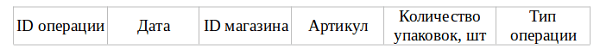

Таблица «Товар» содержит информацию об основных характеристиках каждого товара. Заголовок таблицы имеет следующий вид:

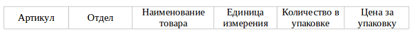

Таблица «Магазин» содержит информацию о местонахождении магазинов. Заголовок таблицы имеет следующий вид:

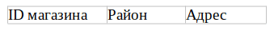

На рисунке приведена схема указанной базы данных

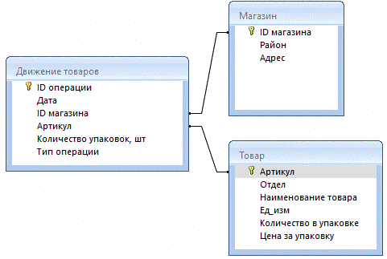

Используя информацию из приведённой базы данных, определите, 
на какую сумму (в руб.) было продано 
**варенца термостатного** в 
магазинах **Нагорного района** 
за период **с 5 по 14 октября включительно**.
В ответе запишите только число.

Файлы к заданию: [3_23740.ods](3_23740.ods)

Решение

1. Перейдем на лист **Товар**

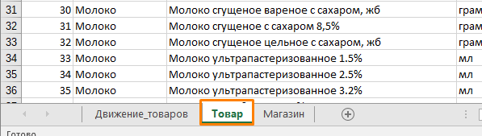

2. Найдем варенец термостатный и запомним его Артикул = **11**(Артикул в данном случае выступает в роли первичного ключа). В дальнейшем мы будем искать его на листе Джвижение_товаров по Артикулу.

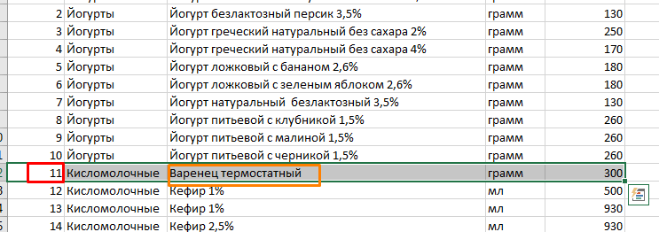 

3. Теперь перейдем на лист **Магазин**.


4. Выделите любую ячейку на первой строке

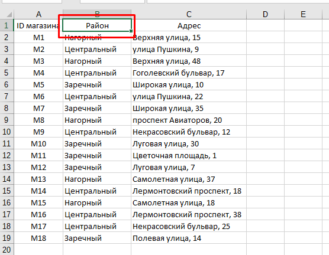

5.  Далее на Вкладке Главная в меню нажмите на кнопку **Сортировка и фильтр**
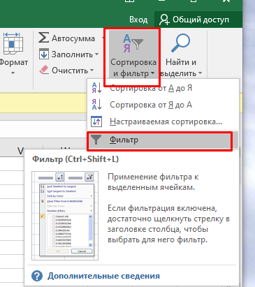

6. Справа от ячейки появится дополнитлеьная кнопка, которая позволяет открыть опции фильтрации. Оставьте галочку только возле Нагорный.

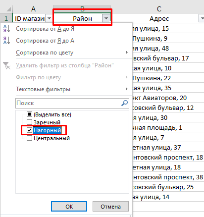

7. Запомните ID-магазинов(первичные ключи) они прригодятся для фильтрации данных на листе **Движение_товаров**

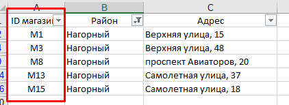

8. Перейдите на лист Движение_товаров и включите фильтрацию

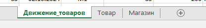

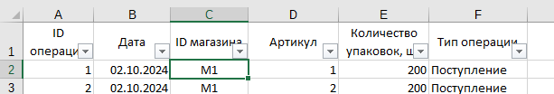

9. Раскройте меню вощел ячейки с Артикулом и установите галочку возле товара с Артикулом **11**() артикул нашего товара из таблицы Товары

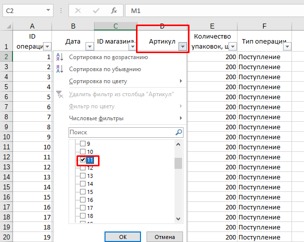

10. Примените фильтр к столбцу ID магазина, оставив только ID магазинов нагорного района: M1, M3, M8, M13, M15.

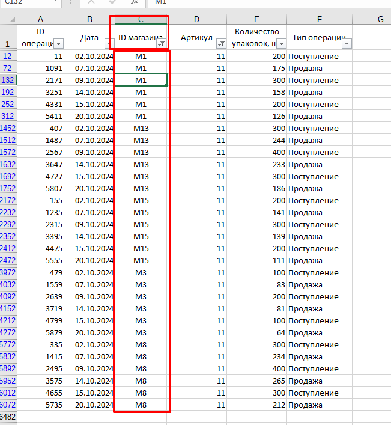

11. Примените фильтр к столбцу Тип операции

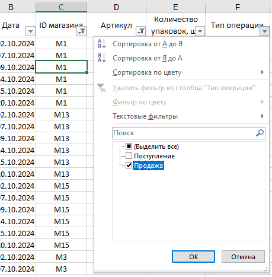

12. Также выберите даты все кроме 20 октября, поскольку по заданию нам дан временной период с 5 по 14 октября включительно.

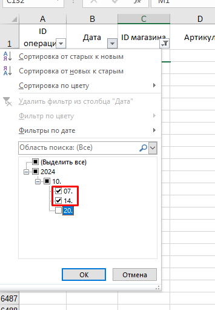

13. Выделите полученные строки(например используя комбинацию клавиш Ctrl+A). Скопируйте данные и перенесите их на новый лист.

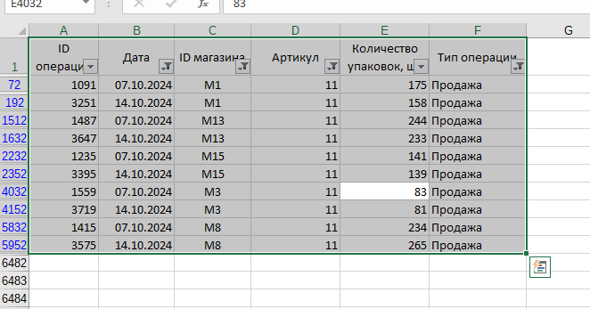

14. Найдем общее количество проданных упаковок.

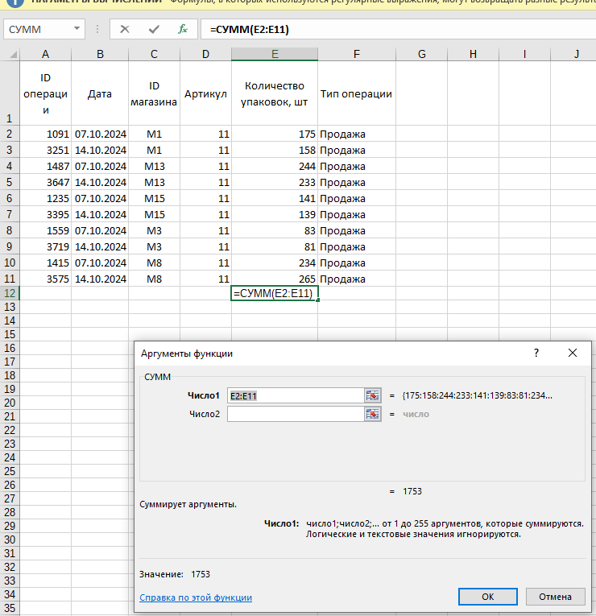

15. Посчитаем итоговую сумму продаж в рублях умножив количество проданных упаковок на цену в 76 рублей.

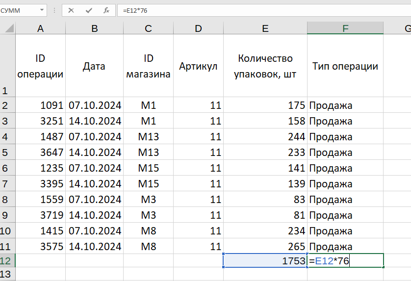

16. Итого получим сумму в 133228 рублей.

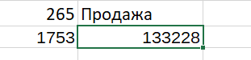

ОТВЕТ: 133228