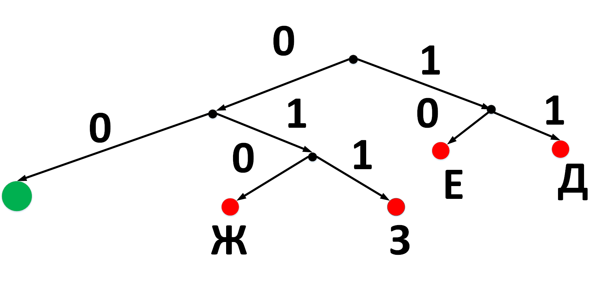
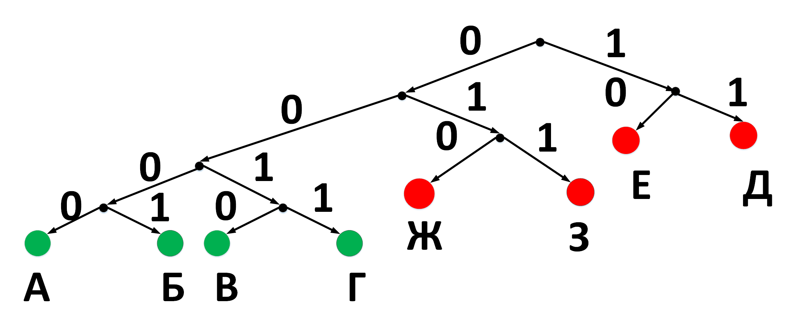
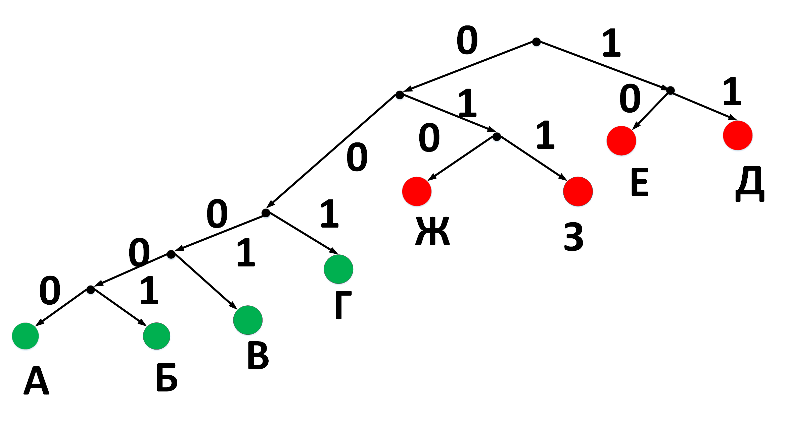
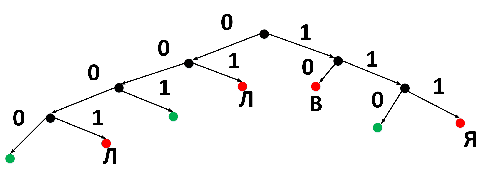
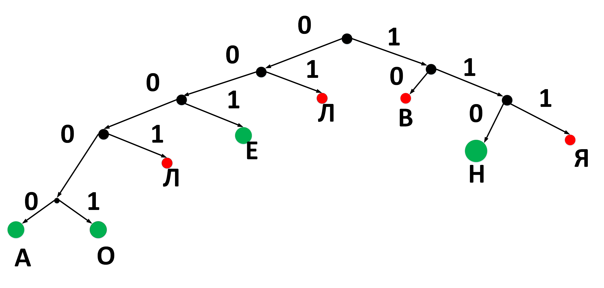
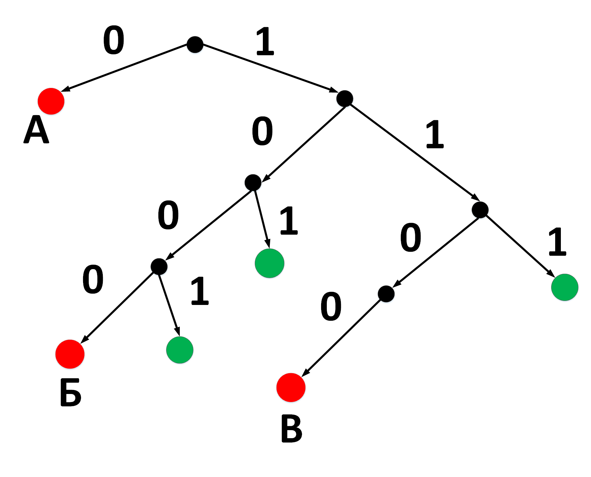

# Задание 4 ЕГЭ по информатике

## Базовый уровень, время – 2 мин

### Тема

**Кодирование и декодирование информации**

### Проверяемые умения

1. Умение кодировать и декодировать информацию
2. Двоичное кодирование. Равномерные и неравномерные коды
3. Декодирование сообщений с помощью неравномерных кодов
4. Условие Фано
5. Построение однозначно декодируемых кодов с помощью дерева
6. Умение строить код с наименьшей средней длиной сообщения при известной частоте символов

### Теоретические основы

#### Кодирование

- Перевод информации с одного языка на другой
- Запись в другой системе символов, в другом алфавите
- Обычно: с "человеческого" языка → в двоичный код
- **Декодирование** – обратный переход

#### Виды кодирования

- **Один символ** исходного сообщения → один символ нового кода
- **Один символ** → несколько символов нового кода
- **Несколько символов** → один символ нового кода

#### Равномерное vs Неравномерное кодирование

- **Равномерное**: все символы → коды равной длины
- **Неравномерное**: разные символы → коды разной длины

#### Условие Фано

- **Прямое условие Фано**: никакое кодовое слово не является началом другого
- **Обратное условие Фано**: никакое кодовое слово не является окончанием другого
- Выполнение одного из условий достаточно, но не необходимо для однозначного декодирования

#### Что такое двоичное дерево

# Двоичное дерево

## Определение

**Двоичное дерево** — древовидная структура данных, в которой каждый узел имеет не более двух потомков (левый и правый).

## Структура узла

```
    [Родитель]
     /      \
[Левый]  [Правый]
```

## Применение в кодировании

В задачах кодирования двоичное дерево используется для представления кодов:

- **Корень** — пустая строка
- **Левая ветвь** → добавляется `0`
- **Правая ветвь** → добавляется `1`
- **Листья** — готовые кодовые слова

## Пример построения кодов

```
        ""
       /  \
      0    1
     / \    \
   00  01   11
   /    \    \
 000   010  110 (кодовые слова)
```

## Свойства для кодов Фано

- Каждое кодовое слово соответствует **листу** дерева
- Условие Фано выполняется автоматически
- Можно наглядно находить свободные коды

#### Важно!

- Если в условии сказано "код удовлетворяет условию Фано" → имеется в виду **прямое** условие
- Если сказано "код допускает однозначное декодирование" → нужно проверять **оба** условия

### Пример 1

**№ [23741](https://kompege.ru/task) Демоверсия 2026 (Уровень: Базовый)**

По каналу связи передаются сообщения, содержащие только восемь букв: А, Б, В, Г, Д, Е, Ж и З.
Для передачи используется двоичный код, удовлетворяющий условию Фано.
Кодовые слова для некоторых букв известны.

| Буква | Код |
|-------|-----|
| Е     | 10  |
| Ж     | 010 |
| З     | 011 |
| Д     | 11  |

Какое наименьшее количество двоичных знаков требуется для кодирования четырёх оставшихся букв? В ответе запишите
суммарную длину кодовых слов для букв: А, Б, В, Г.

Примечание. Условие Фано означает, что никакое кодовое слово не является началом другого кодового слова. Это
обеспечивает возможность однозначной расшифровки закодированных сообщений.

**Решение.**

1. Нарисуем двоичное дерево. На листах этого дерева отметим буквы, для которых уже заданы кодовые слова



2. для того чтобы выполнить условие Фано (ни одно кодовое слово не совпадает с началом другого кодового слова),
   необходимо, чтобы все буквы размещались в листьях дерева
3. у нас осталась единственная свободная ветка 00, на которую нужно «навесить» буквы; нам нужно навесить четыре буквы.
   следовательно, надо сделать два ответвления с двумя ветками на каждой.
   На каждый "листочек" мы можем закрепить в итоге по одной из оставшихся четырех букв.
   Порядок для нас не важен, поскольку в задании нас просят узнать "длины" кодовых слов для оставшихся четырех букв.



4. Получаем следующие коды.

| Буква | Код  |
|-------|------|
| А     | 0000 |
| Б     | 0001 |
| В     | 0010 |
| Г     | 0011 |

5. Длина каждого кодового слова для букв А,Б, В, Г будет 4. Итого суммарная длина
   кодовых слов для четырех букв будет **16**.

**Ответ: 16**

> ### Примечание
> Мы можем конечно же `навесить` буквы по-другому(вариантов бесконечное множество), чтобы было соблюдено условие Фано.
> Например, так.



> В этом случае коды будут следующие

| Буква | Код   |
|-------|-------|
| А     | 00000 |
| Б     | 00001 |
| В     | 0001  |
| Г     | 001   |

> Итого **суммарная** длина кодовых слов для четырех букв будет **17**.
> В задании просят найти **наименьшее** количество двоичных знаков для кодирования четырёх букв.
> Таким образом этот вариант нам **не подходит**.

### Пример 2

**№ [23550](https://kompege.ru/task) Пересдача 03.07.25 (Уровень: Базовый)**

По каналу связи передаются сообщения, содержащие только восемь букв: А, В, Е, Л, Н, О, С, Я. Для передачи используется
двоичный код, удовлетворяющий условию Фано.
Кодовые слова для некоторых букв известны: В - 10, Л - 01, С - 0001, Я - 111. Для четырёх оставшихся букв А, Е, Н, и О
кодовые слова неизвестны. Какое наименьшее количество двоичных знаков требуется для кодирования слова ВСЕЛЕННАЯ?
Примечание. Условие Фано означает, что никакое кодовое слово не является началом
другого кодового слова. Это обеспечивает возможность однозначной расшифровки закодированных
сообщений.

1. Нарисуем двоичное дерево. На листах этого дерева отметим буквы,
   для которых уже заданы кодовые слова.



2. Сделаем табличку, в которой укажем известные на данный момент коды букв, длины кодовых слов, а также частота
   встечаемости букв в слове ВСЕЛЕННАЯ.

| Буква | Код  | Длина | Количество повторений в слове |
|-------|------|-------|-------------------------------|
| А     | -    | -     | 1                             |
| В     | 10   | 2     | 1                             |
| Е     | -    | -     | 2                             |
| Л     | 01   | 2     | 1                             |
| Н     | -    | -     | 2                             |
| О     | -    | -     | 0                             |
| С     | 0001 | 4     | 1                             |
| Я     | 111  | 3     | 1                             |

3. Буквы Е и Н встречаются в слове чаще всего: по два раза. Буква А - один раз, буква О - вообще ни разу. По условию нам
   надо, чтобы количество двоичных знаков
   требуемое для кодирования слова ВСЕЛЕННАЯ было **минимально**. Следовательно надо для букв Е и Н найти как можно
   короткие кодовые слова. Для буквы О - можно выбрать любой из оставшихся.

4. Судя по рисунку выше. В нашем дереве три свободные веточки, на которые можно **подвесить** буквы. Нам нужно
   придумать коды для четырех. Одну из веточек придется раздвоить.
   Учтем рассуждения из предыдущего шага. У нас есть две свободные веточки с длинами кодовых слов 3: 001
   и 110. На эти две веточки подвесим соответственно буквы Е и Н.
5. Веточку 0000 раздвоим на 00001 и 00000, и подвесим на них две оставшиеся буквы А и О. Получим вот такое дерево.



6. Получим такую табличку.

| Буква | Код   | Длина | Количество повторений в слове |
|-------|-------|-------|-------------------------------|
| А     | 00000 | 5     | 1                             |
| В     | 10    | 2     | 1                             |
| Е     | 001   | 3     | 2                             |
| Л     | 01    | 2     | 1                             |
| Н     | 110   | 3     | 2                             |
| О     | 00001 | 5     | 0                             |
| С     | 0001  | 4     | 1                             |
| Я     | 111   | 3     | 1                             |

7. Осталось посчитать суммарную длину слова ВСЕЛЕННАЯ.
   Получаем: 2 + 4 + 3 + 2 + 3 + 3 + 3 + 5 + 3 = 28

**Ответ: 28**


### Пример 3

**[23363](https://kompege.ru/task) Резервный день 19.06.25 (Уровень: Базовый)**

По каналу связи передаются сообщения, содержащие только четыре буквы: А, Б, В, Г. 
Для передачи используется двоичный код, удовлетворяющий условию Фано.
Для букв А, Б, В используются такие кодовые слова: 
А - 0; Б - 1100; B - 1000.
Укажите кратчайшее кодовое слово для буквы Г, при котором код допускает 
однозначное декодирование. Если таких слов несколько, укажите код
с наибольшим числовым значением.
Примечание. Условие Фано означает, что никакое кодовое слово 
не является началом другого кодового слова. 
Это обеспечивает возможность однозначной расшифровки 
закодированных сообщений.

1. Нарисуем двоичное дерево. На листах этого дерева отметим буквы,
   для которых уже заданы кодовые слова. Также отметим ветви, на которые можно подвесить оставшуюся одну букву Г.



2. Проанализируем данные.  В нашем распоряжении есть три возможных кода для буквы Г. 

| Буква | Код  | Длина | Числовое значение(перевели в 10-ую систему счисления) | 
|-------|------|-------|-------------------------------------------------------|
| Г     | 101  | 3     | 5                                                     |
| Г     | 111  | 3     | 7                                                     |
| Г     | 1001 | 4     | 9                                                     |

3. Нам нужно выбрать **кратчайшее** кодовое слово(тут два кратчайших кодовых слова длины 3) с **наибольшим** числовым значением(т.е. какое из кодов больше по величине если сравнивать их как двоичные числа).
Если трудно сравнивать двоичные числа, то можно каждое двоичное число перевести в десятичную систему и потом сравнить их как десятичные числа.
У нас два кода длины 3: 101(число 5 в 10-ой СС) и 111(число 7 в 10-ой СС). Наибольшее из кодов по величине это **111**.

Ответ: **111**


