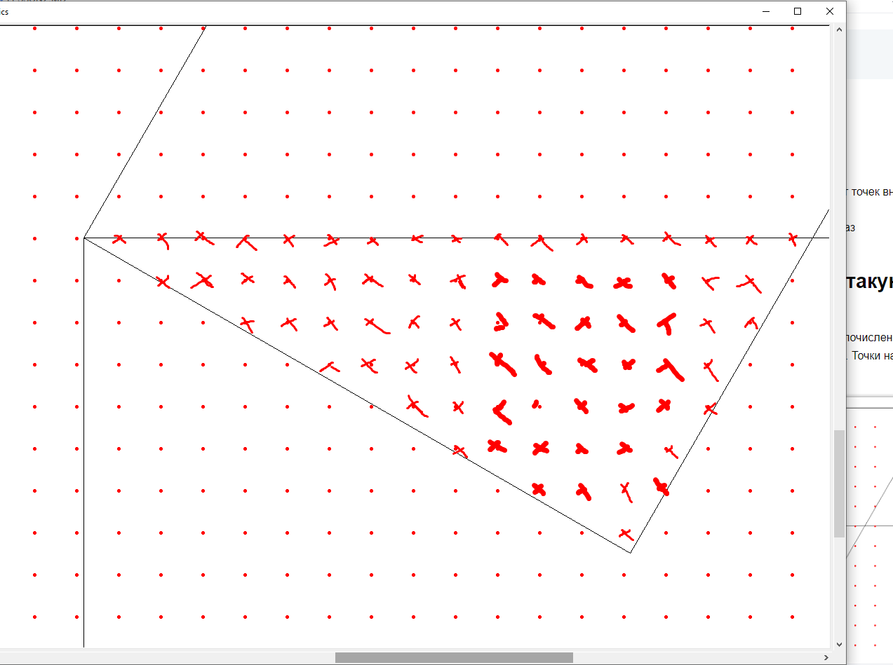

# Анализ задания 6 ЕГЭ по информатике

## Общая информация

- **Номер задания:** 6
- **Уровень сложности:** Базовый
- **Рекомендуемое время:** 2-3 минуты
- **Тип ответа:** Числовой ответ (целое число или последовательность цифр)

## Проверяемые темы и умения

### Кодификатор ЕГЭ

**1.6. Анализ алгоритмов для исполнителей**

- Исполнители Робот, Чертёжник, Редактор и другие
- Система команд исполнителя
- **Анализ алгоритмов управления исполнителями**
- Определение результата работы алгоритма по его описанию
- Определение исходных данных по результатам работы алгоритма

**2.6. Умения**

- Анализировать алгоритмы управления исполнителями
- Определять результат выполнения алгоритма
- Строить траекторию движения исполнителя
- Вычислять координаты точек, количество точек и другие характеристики

## Особенности задания 6

### Типичные формулировки
- "Определите, сколько точек с целочисленными координатами..."
- "Найдите количество точек, удовлетворяющих условию..."
- "Определите площадь/периметр полученной фигуры..."

### Часто используемые инструменты
- **Библиотека Turtle** в Python
- Исполнитель **Чертёжник**
- Координатная плоскость
- Целочисленные координаты

### Ключевые навыки
1. **Чтение и анализ кода** на Python с библиотекой Turtle
2. **Построение траектории** движения исполнителя
3. **Определение координат** точек пересечения
4. **Подсчёт количества** целочисленных точек внутри/на границе фигуры
5. **Вычисление площади** методом Пика или другими способами

### Типичные алгоритмы
- Построение геометрических фигур
- Закрашивание областей
- Расстановка точек на сетке
- Обход координатной плоскости

### Стратегия решения
1. Внимательно прочитать код программы
2. Построить траекторию движения "черепашки"
3. Определить полученную фигуру
4. Найти искомые точки/координаты
5. Проверить ответ на соответствие условию


# Команды библиотеки Turtle (Python)
## Для задания 6 ЕГЭ по информатике

### О библиотеке Turtle
**Turtle** — стандартная библиотека Python для обучения программированию через визуализацию.  
- **Происхождение**: Основана на языке Logo (1967 год), созданном для обучения детей  
- **Назначение**: Рисование графики с помощью "черепашки", которая перемещается по экрану  
- **Использование в ЕГЭ**: Для задач на анализ алгоритмов и построение графических фигур  

### Основные команды движения

| Команда | Сокращение | Описание |
|---------|------------|-----------|
| `forward(n)` | `fd(n)` | Движение вперёд на n пикселей |
| `backward(n)` | `bk(n)` | Движение назад на n пикселей |
| `right(angle)` | `rt(angle)` | Поворот направо на angle градусов |
| `left(angle)` | `lt(angle)` | Поворот налево на angle градусов |

### Команды позиционирования

| Команда | Сокращение | Описание |
|---------|------------|-----------|
| `setposition(x, y)` | `setpos(x, y)` | Перемещение в точку (x, y) |
| `goto(x, y)` | - | Перемещение в точку (x, y) |
| `setx(x)` | - | Установка координаты X |
| `sety(y)` | - | Установка координаты Y |

### Команды управления пером

| Команда | Сокращение | Описание |
|---------|------------|-----------|
| `penup()` | `up()` | Поднять перо (не рисовать) |
| `pendown()` | `down()` | Опустить перо (рисовать) |
| `pensize(width)` | `width(width)` | Толщина линии |
| `dot(size, color)` | - | Нарисовать точку |

### Команды управления окном

| Команда | Сокращение | Описание |
|---------|------------|-----------|
| `screensize(w, h)` | - | Установка размера холста |
| `tracer(n)` | - | Управление анимацией (0 - выкл) |
| `mainloop()` | - | Главный цикл программы |

### Команды из примера ЕГЭ

| Команда в примере | Что делает |
|-------------------|------------|
| `tracer(0)` | Отключает анимацию для ускорения |
| `screensize(5000, 5000)` | Устанавливает большой холст |
| `up()` | Поднимает перо (перемещение без рисования) |
| `down()` | Опускает перо (начало рисования) |
| `rt(120)` | Поворот направо на 120° |
| `fd(10 * k)` | Движение вперёд на 10*k пикселей |
| `setpos(i * k, j * k)` | Перемещение в координаты (i*k, j*k) |
| `dot(3, 'red')` | Рисует красную точку размером 3 пикселя |
| `mainloop()` | Запускает главный цикл программы |

### Особенности в ЕГЭ
- **tracer(0)** — всегда используется для ускорения отрисовки  
- **Коэффициент k** — масштабный коэффициент для удобства расчетов  
- **setpos() с циклами** — часто используется для расстановки точек на сетке  
- **mainloop()** — обязателен в конце для отображения результата

### Пример 1

# Задание № 13845 (Уровень: Сложный)

## Условие задачи

**Автор:** Е. Джобс  
**Исполнитель:** Черепаха  
**Система координат:** Декартова плоскость

### Начальное состояние исполнителя
- Положение: начало координат (0, 0)
- Направление: вдоль положительного направления оси ординат (вверх)
- Хвост: опущен (режим рисования)

### Система команд исполнителя

| Команда | Описание |
|---------|-----------|
| `Поднять хвост` | Переход к перемещению без рисования |
| `Опустить хвост` | Переход в режим рисования |
| `Вперёд n` | Передвижение на n единиц по направлению головы |
| `Назад n` | Передвижение в противоположном направлении |
| `Направо m` | Поворот на m° по часовой стрелке |
| `Налево m` | Поворот на m° против часовой стрелки |
| `Повтори k [Команды]` | Повтор последовательности команд k раз |

### Алгоритм для исполнения

```
Поднять хвост
Повтори 10 [Вправо 120 Вперед 10]
Опустить хвост
Повтори 7 [Вперед 15 Вправо 90]
Повтори 5 [Вправо 60 Вперед 20 Вправо 30]
```

### Вопрос задачи

**Сколько точек с целочисленными координатами находится внутри пересечения полученных контуров?**

*Примечание:* Точки на линиях контуров учитывать не следует.

---

## Особенности задачи

- **Уровень сложности:** Высокий
- **Тип:** Геометрический анализ траектории исполнителя
- **Ключевые элементы:**
  - Анализ нескольких контуров
  - Поиск пересечения фигур
  - Подсчёт целочисленных точек внутри области
  - Исключение точек на границах

# Полное решение задачи 13845 

```python
from turtle import *

# Инициализация графического окна
tracer(0)              # Отключаем анимацию для ускорения рисования
screensize(5000, 5000) # Устанавливаем большой размер холста
seth(90)               # Устанавливаем начальное направление: 90° (вверх)
k = 60                 # Масштабный коэффициент для удобства расчетов

# Первая фигура: перемещение без рисования (10-угольник)
up()                   # Поднимаем перо - не рисуем при перемещении
for i in range(10):
    rt(120)            # Поворот направо на 120°
    fd(10 * k)         # Движение вперед на 10*k = 600 пикселей

# Вторая фигура: квадратная спираль (7 отрезков)
down()                 # Опускаем перо - начинаем рисовать
for i in range(7):
    fd(15 * k)         # Движение вперед на 15*k = 900 пикселей
    rt(90)             # Поворот направо на 90°

# Третья фигура: пятиконечная звезда
for i in range(5):
    rt(60)             # Поворот направо на 60°
    fd(20 * k)         # Движение вперед на 20*k = 1200 пикселей
    rt(30)             # Поворот направо на 30°

# Расстановка точек для визуализации сетки
up()                   # Поднимаем перо для перемещения без рисования
for i in range(-30, 30):     # Цикл по координате X от -30 до 29
    for j in range(-30, 30): # Цикл по координате Y от -30 до 29
        setpos(i * k, j * k) # Перемещаемся к координатам (i*60, j*60)
        dot(5, 'red')        # Рисуем красную точку размером 5 пикселей

update()    # Принудительно обновляем экран после отрисовки
mainloop()  # Запускаем главный цикл программы для отображения окна
```

# Анализ программы для визуализации

## Структура программы

### Инициализация
```python
from turtle import *
tracer(0)              # Отключение анимации для ускорения
screensize(5000, 5000) # Большой холст для отображения
seth(90)               # Направление: 90° (вверх по оси Y)
k = 60                 # Масштабный коэффициент
```

### Первая фигура (перемещение без рисования)
```python
up()                   # Поднять перо (не рисовать)
for i in range(10):
    rt(120)            # Поворот направо на 120°
    fd(10 * k)         # Движение вперёд на 600 пикселей
```
**Результат:** Звездообразная траектория (10-угольник)

### Вторая фигура (квадратная спираль)
```python
down()                 # Опустить перо (начать рисовать)
for i in range(7):
    fd(15 * k)         # Движение вперёд на 900 пикселей
    rt(90)             # Поворот направо на 90°
```
**Результат:** Квадратная спираль из 7 отрезков

### Третья фигура (звезда)
```python
for i in range(5):
    rt(60)             # Поворот направо на 60°
    fd(20 * k)         # Движение вперёд на 1200 пикселей
    rt(30)             # Поворот направо на 30°
```
**Результат:** Пятиконечная звезда

### Расстановка точек сетки
```python
up()                   # Поднять перо
for i in range(-30, 30):
    for j in range(-30, 30):
        setpos(i * k, j * k)  # Перемещение к координатам (i*60, j*60)
        dot(5, 'red')         # Рисование красной точки размером 5px
```

### Завершение
```python
update()    # Принудительное обновление экрана
mainloop()  # Главный цикл программы
```

## Особенности визуализации

- **Сетка точек:** 60×60 точек с шагом 60 пикселей
- **Координатный диапазон:** от -1800 до +1800 по обеим осям
- **Цель программы:** Визуализация пересечения фигур и подсчёт точек внутри областей
- **Масштаб:** Коэффициент k=60 увеличивает все размеры в 60 раз

## После визуализации получаем вот такую картину

Два квадрата пересекаются. Теперь подсчитаем сколько точек с целочисленными координатами 
находится внутри пересечения полученных контуров.
Точки на линиях контуров учитывать не следует.


Подсчитаем



получится 74 точки.

**Ответ: 74**
