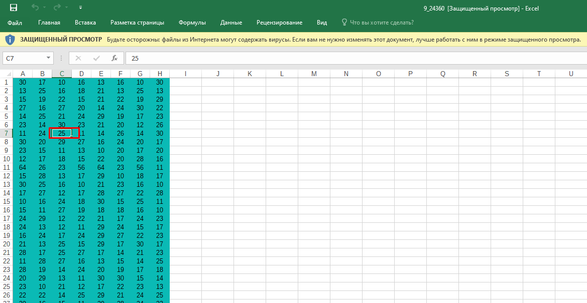
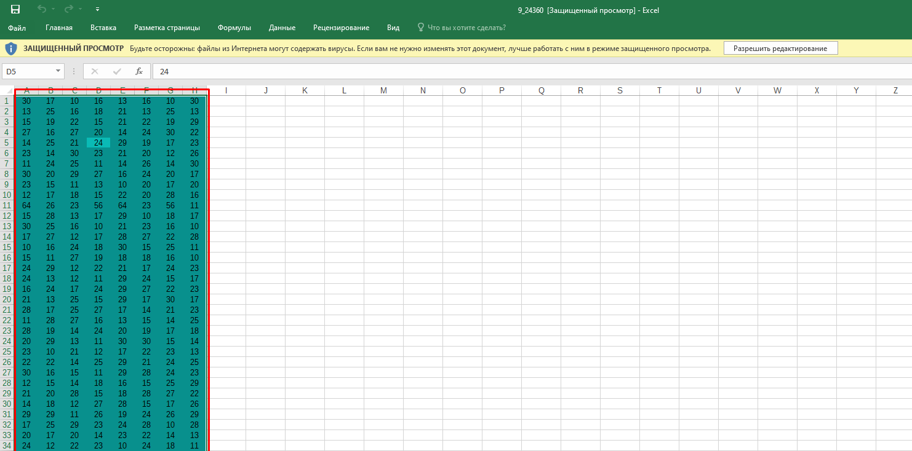
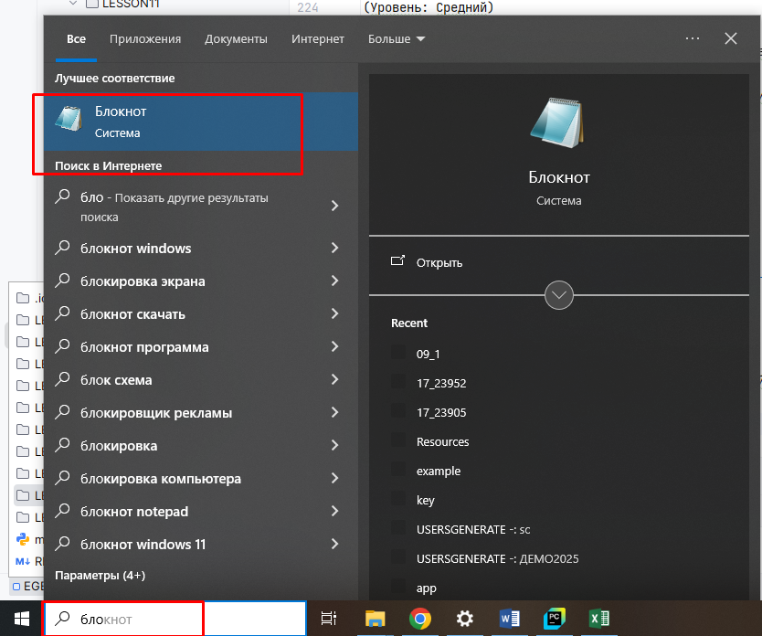
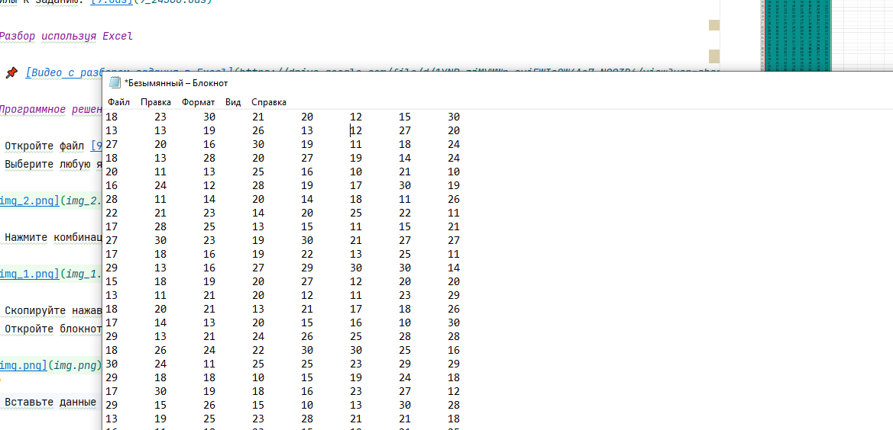
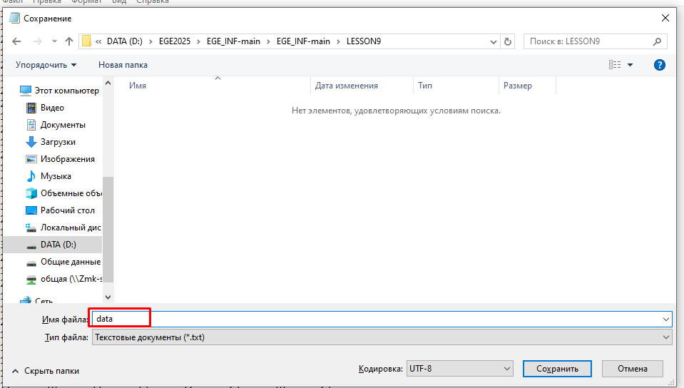

# 📘 Анализ задания №9 ЕГЭ по информатике

## Оглавление

- [Общая информация](#общая-информация)
- [Суть задания](#суть-задания)
- [Проверяемые умения (Кодификатор ЕГЭ)](#проверяемые-умения-кодификатор-егэ)
- [Базовая теория для решения](#базовая-теория-для-решения)
  - [Логические операции](#1-логические-операции)
  - [Агрегатные функции](#2-агрегатные-функции)
  - [Условия и ветвления](#3-условия-и-ветвления)
- [Работа с данными в Excel](#работа-с-данными-в-excel)
- [Работа с данными в Python](#работа-с-данными-в-python)
- [Типичные формулировки задания №9](#типичные-формулировки-задания-№9)
- [Стратегия решения](#стратегия-решения)
- [Советы](#советы)
- [Как сохранить данные из файла ods или excel в txt](#как-сохранить-данные-из-файла-ods-или-excel-в-txt)
- [Пример структуры файла `data.txt`](#пример-структуры-файла-datetxt)
- [Разборы задач](#разборы-задач)
  - [Разбор №1: (kompege №24360)](#-разбор-№1-kompege-№24360)
  - [Разбор №2: (kompege №24359)](#-разбор-№2-kompege-№24359)
  - [Разбор №3: (kompege №24347)](#-разбор-№3-kompege-№24347)
  - [Разбор №4: (kompege №24346)](#-разбор-№4-kompege-№24346)
  - [Разбор №5: (kompege №24345)](#-разбор-№5-kompege-№24345)
  - [Разбор №6: (kompege №24344)](#-разбор-№6-kompege-№24344)

---

## Общая информация

- **Номер задания:** 9  
- **Уровень сложности:** Базовый  
- **Рекомендуемое время:** 5–7 минут  
- **Тип ответа:** Целое число или последовательность цифр  
- **Формат данных:** Таблица (в КИМ — фрагмент электронной таблицы)

---

## Суть задания

Вам даётся **таблица с данными** (обычно 1000+ строк), содержащая несколько столбцов (поля):  
например, *ID, Фамилия, Возраст, Город, Балл, Категория* и т.д.

Требуется:
- **Проанализировать данные**,  
- **Применить фильтрацию по условиям**,  
- **Выполнить агрегацию** (подсчёт, суммирование, поиск максимума/минимума),  
- **Дать числовой ответ**.

> 💡 Это задание проверяет **умение работать с табличными данными**, а не знание формул как таковых.

---

## Проверяемые умения (Кодификатор ЕГЭ)

**2.5. Обработка структурированных данных**

- Чтение и интерпретация табличных данных  
- Фильтрация записей по одному или нескольким условиям  
- Использование логических операций (И, ИЛИ, НЕ)  
- Агрегатные функции: сумма, количество, среднее, максимум, минимум  
- Работа с текстовыми и числовыми данными

---

## Базовая теория для решения

### 1. Логические операции

| Операция | Excel | Python | Пример условия |
|--------|-------|--------|----------------|
| **И** | `И(A2>10; B2="М")` | `and` | Возраст > 10 **и** пол = "М" |
| **ИЛИ** | `ИЛИ(C2="Москва"; C2="СПб")` | `or` | Город = Москва **или** СПб |
| **ИСКЛИЛИ** | `ИСКЛИЛИ(...)` | `!=` для булевых | Только одно из условий истинно |
| **НЕ** | `НЕ(D2="Отказ")` | `not` | Статус **не** "Отказ" |

> 💡 В Python условия пишутся в `if`, `list comprehension` или при фильтрации данных.

---

### 2. Агрегатные функции

| Задача | Excel | Python (наивно) |
|-------|--------|------------------|
| Посчитать строки | `=СЧЁТ(A2:A1001)` | `len(data)` |
| Посчитать по условию | `=СЧЁТЕСЛИ(диапазон; критерий)` | `sum(1 for row in data if условие)` |
| Сумма | `=СУММ(E2:E1001)` | `sum(row[col] for row in data)` |
| Сумма по условию | `=СУММЕСЛИ(диапазон_условия; критерий; диапазон_суммы)` | `sum(row[col_sum] for row in data if row[col_cond] == критерий)` |
| Максимум / Минимум | `=МАКС(...)`, `=МИН(...)` | `max(...)`, `min(...)` |

---

### 3. Условия и ветвления

- В Excel: `=ЕСЛИ(условие; значение_если_истина; значение_если_ложь)`  
- В Python:  
  ```python
  result = value_if_true if condition else value_if_false
  ```

---

## Работа с данными в Excel

### Типичные шаги:
1. Открыть файл с таблицей.
2. Добавить **вспомогательный столбец** с формулой (например, `=ЕСЛИ(И(...); 1; 0)`).
3. Использовать **фильтр** для отбора строк.
4. Применить **агрегатные функции** к отфильтрованным данным.

### Часто используемые функции:
- `СЧЁТЕСЛИ` / `СЧЁТЕСЛИМН` — подсчёт по одному или нескольким условиям  
- `СУММЕСЛИ` / `СУММЕСЛИМН` — суммирование по условиям  
- `ЕСЛИ` + `И` / `ИЛИ` — сложные логические условия  
- `ЛЕВСИМВ`, `ПРАВСИМВ`, `ДЛСТР` — для работы с текстом (редко, но бывает)

> 💡 **СЧЁТЕСЛИМН** и **СУММЕСЛИМН** позволяют задавать **до 127 условий** — очень мощный инструмент.

---

## Работа с данными в Python

Поскольку вы копируете данные из Excel и сохраняете в `.txt`, предполагается **простой текстовый формат** (например, значения через табуляцию или пробел).

### 1. Открытие и чтение файла

```python
with open('data.txt', 'r', encoding='utf-8') as f:
    lines = f.readlines()
```

### 2. Парсинг строк

Если данные разделены **табуляцией** (как при копировании из Excel):

```python
data = []
for line in lines:
    parts = line.strip().split('\t')  # или split() для пробелов
    data.append(parts)
```

> 💡 Первая строка — часто **заголовки**, её можно пропустить: `data = data[1:]`

### 3. Анализ данных

#### Пример: посчитать, сколько строк, где столбец 2 = "М" и столбец 3 > 18

```python
count = 0
for row in 
    if row[1] == "М" and int(row[2]) > 18:
        count += 1
print(count)
```

#### Пример: сумма значений в столбце 4 при условии

```python
total = 0
for row in 
    if row[0] == "Категория А":
        total += int(row[3])
print(total)
```

### 4. Использование списковых включений (list comprehensions)

```python
# Список баллов для Москвы
scores = [int(row[4]) for row in data if row[2] == "Москва"]

# Количество таких записей
count = len(scores)

# Сумма
total = sum(scores)
```

---

## Типичные формулировки задания №9

- «Сколько записей удовлетворяют условию: **пол = "Ж" и возраст > 25**?»  
- «Чему равна **сумма баллов** у участников из школы №5?»  
- «Найдите **максимальный рост** среди юношей ростом не менее 170 см.»  
- «Сколько записей, в которых **хотя бы одно** из полей содержит значение "Да"?»  
- «Определите **средний балл** (целую часть) для категории "Профи".»

---

## Стратегия решения

### В Excel:
1. Проанализируйте структуру таблицы (заголовки, типы данных).
2. Определите, какие столбцы участвуют в условии.
3. Используйте `СЧЁТЕСЛИМН` или `СУММЕСЛИМН` напрямую, **либо**:
   - Создайте вспомогательный столбец с `=ЕСЛИ(ИЛИ(...); 1; "")`
   - Просуммируйте его через `=СУММ(...)`

### В Python:
1. Прочитайте файл.
2. Разбейте на строки и поля.
3. Напишите цикл с условиями.
4. Накапливайте результат (счётчик, сумму и т.д.).
5. Выведите ответ.

---

## Советы

- **В Excel** — всегда проверяйте, включены ли **заголовки** в диапазон (обычно нет!).
- **В Python** — не забывайте **преобразовывать строки в числа** (`int()`, `float()`).
- Если в данных есть **пропуски** — добавьте проверку: `if row[2].strip() != ''`.
- Для **точного соответствия** — учитывайте регистр (`"москва" ≠ "Москва"`).

---

## Как сохранить данные из файла ods или excel в txt.

1. Откройте файл [9.ods](9_24360.ods)
2. Выберите любую ячейку таблицы с данными



2. Нажмите комбинацию Ctrl+A(для выделения данных в файле)



3. Скопируйте нажав комбинацию Ctrl+C
4. Откройте блокнот



5. Вставьте данные в блокнот 



6. Cохраните файл в папку в которой будет скрипт питона, например под названием data.txt.



---

## Пример структуры файла `data.txt`

```text
ID	Фамилия	Пол	Возраст	Балл
1	Иванов	М	17	85
2	Петрова	Ж	18	92
3	Сидоров	М	16	78
...
```

Python-код для подсчёта девушек с баллом ≥ 90:

```python
with open('data.txt', 'r', encoding='utf-8') as f:
    lines = f.readlines()[1:]  # пропускаем заголовок

count = 0
for line in lines:
    parts = line.strip().split('\t')
    if parts[2] == 'Ж' and int(parts[4]) >= 90:
        count += 1

print(count)
```

> ✅ Задание №9 — одно из самых **предсказуемых** в ЕГЭ. Освоив Excel и базовый Python, вы легко справитесь с любым вариантом.

---

## Разборы задач

### 📘 Разбор №1: (kompege №24360)

(Уровень: Средний)

(А. Ходарин) Откройте файл электронной таблицы, содержащей в каждой строке восемь натуральных чисел. Определите минимальную сумму чисел в строке таблицы, содержащей числа, для которой выполнено ровно одно условие:
– квадрат минимального числа присутствует в строке;
– из чисел строки можно получить три пары одинаковых чисел (например, строку с числами 8 9 6 4 8 9 6 2 можно представить тремя парами одинаковых чисел: 8 8 9 9 6 6, а строку 1 2 7 8 8 2 1 7 можно представить, например, тремя парами одинаковых чисел 1 1 2 2 7 7).

В ответе запишите только число.

Файлы к заданию: [9.ods](9_24360.ods)

#### 📌 [Видео с разбором задания в Excel](https://drive.google.com/file/d/1YNP_zjMVWWr-sviEWIsOW4Ao7_NQQ3D6/view?usp=sharing)

#### 📘 Анализ программного решения задачи №24360  
**Уровень: Средний**

##### Условие задачи (кратко)

- В файле — строки по **8 натуральных чисел**.  
- Для каждой строки проверяются **два условия**:  
  1. **Квадрат минимального числа присутствует в строке.**  
  2. **Из чисел строки можно составить три пары одинаковых чисел** (т.е. выбрать 6 чисел, образующих 3 пары).  
- Нужно найти **минимальную сумму** среди строк, для которых **выполнено ровно одно** из условий.

> 💡 Ответ — целое число (минимальная сумма подходящей строки).

---

##### 🔍 Программное решение

```python
data_sums = []
for line in open('data.txt'):
    data = [int(x) for x in line.split()]
    f1 = (min(data) ** 2) in data
    counts = [data.count(c) for c in set(data)]
    total_pairs = sum(count // 2 for count in counts)
    f2 = total_pairs >= 3
    if f1 != f2:
        data_sums.append(sum(data))

print(min(data_sums))
```

---

##### 📚 Пошаговый разбор кода

1. **Инициализация списка сумм**  
   ```python
   data_sums = []
   ```
   - Создаётся пустой список `data_sums` для хранения сумм строк, удовлетворяющих условию «**ровно одно из двух**».

2. **Чтение файла построчно**  
   ```python
   for line in open('data.txt'):
   ```
   - Открывает файл `data.txt` и читает его **построчно**.  
   - Предполагается, что файл содержит **8 натуральных чисел в каждой строке**, разделённых пробелами или табуляцией.

3. **Преобразование строки в список чисел**  
   ```python
       data = [int(x) for x in line.split()]
   ```
   - `line.split()` разбивает строку на отдельные элементы (по пробелам/табам).  
   - `int(x)` преобразует каждый элемент в целое число.  
   - Результат — список `data` из 8 натуральных чисел.

4. **Проверка первого условия**  
   ```python
       f1 = (min(data) ** 2) in data
   ```
   - `min(data)` — находит **минимальное число** в строке.  
   - `min(data) ** 2` — вычисляет его **квадрат**.  
   - Оператор `in` проверяет, **присутствует ли этот квадрат** среди чисел строки.  
   - Результат сохраняется в логическую переменную `f1` (`True` или `False`).

5. **Подсчёт частот встречаемости чисел**  
   ```python
       counts = [data.count(c) for c in set(data)]
   ```
   - `set(data)` — получает **уникальные числа** из строки.  
   - Для каждого уникального числа `c` функция `data.count(c)` считает, **сколько раз оно встречается** в строке.  
   - Результат — список `counts`, содержащий **частоты всех уникальных чисел**.

   > 💡 Например, для строки `[10, 10, 12, 12, 10, 10, 15, 19]` →  
   > `set(data) = {10, 12, 15, 19}` →  
   > `counts = [4, 2, 1, 1]`

6. **Расчёт общего количества пар**  
   ```python
       total_pairs = sum(count // 2 for count in counts)
   ```
   - Для каждой частоты `count` вычисляется `count // 2` — **максимальное число пар**, которое можно составить из этого числа.  
     - Например: 4 → 2 пары, 2 → 1 пара, 1 → 0 пар.  
   - `sum(...)` складывает все возможные пары.  
   - Результат — **общее количество пар**, которое можно составить из всей строки.

7. **Проверка второго условия**  
   ```python
       f2 = total_pairs >= 3
   ```
   - Проверяет, можно ли составить **хотя бы 3 пары**.  
   - Результат сохраняется в логическую переменную `f2`.

8. **Проверка условия «ровно одно истинно»**  
   ```python
       if f1 != f2:
           data_sums.append(sum(data))
   ```
   - Оператор `!=` для булевых значений эквивалентен **логическому XOR** («исключающее ИЛИ»).  
   - Условие выполняется, если **только одно** из `f1` или `f2` равно `True`.  
   - Если условие выполнено, **сумма чисел строки** добавляется в список `data_sums`.

9. **Вывод минимальной суммы**  
   ```python
   print(min(data_sums))
   ```
   - Находит и выводит **наименьшее значение** среди всех подходящих сумм.  
   - Это и есть **ответ на задачу**.

---

##### ✅ Корректность решения

Программа **полностью соответствует условию задачи**:

- Корректно проверяет **наличие квадрата минимума**.  
- Правильно считает **максимальное количество пар** (учитывая, что из 4 одинаковых чисел можно сделать 2 пары).  
- Использует **XOR-логику** (`f1 != f2`) для проверки «ровно одного условия».  
- Находит **минимальную сумму** среди всех подходящих строк.

> 📌 **Ответ: 98**

---

### 📘 Разбор №2: (kompege №24359)

#### Условие задачи

В файле электронной таблицы каждая строка содержит **восемь натуральных чисел**.  
Требуется найти **сумму чисел в строке с наибольшим номером**, удовлетворяющей **всем трём условиям**:

1. **Структура повторов**:  
   В строке есть:
   - **одно число**, которое встречается **ровно трижды**,
   - **одно число**, которое встречается **ровно дважды**,
   - остальные **три числа** — **уникальны** (встречаются по одному разу).

2. **Сравнение сумм**:  
   **Сумма всех повторяющихся чисел** (с учётом кратности: три раза + два раза)  
   **строго больше** суммы всех **неповторяющихся** чисел.

3. **Куб суммы уникальных повторяющихся значений**:  
   Куб **суммы различных повторяющихся чисел** (каждое берётся **один раз**)  
   **не меньше**, чем **удвоенное минимальное число** в строке.

> В ответе нужно записать **только сумму всех восьми чисел** в такой строке с **наибольшим номером**.

Файлы к заданию: [9.ods](9_24359.ods)
---

#### Решение на Python (с подробными комментариями)

```python
# Переменная для хранения суммы последней (наибольшей по номеру) подходящей строки
data_sums = None

# Открываем файл и читаем построчно
for line in open('data24359.txt'):
    # Преобразуем строку в список целых чисел
    data = [int(x) for x in line.split()]  # data — список из 8 чисел

    # Считаем, сколько раз каждое число встречается в строке
    # counts[i] = сколько раз встречается data[i]
    counts = [data.count(c) for c in data]

    # === Проверка условия 1: структура повторов ===
    # В корректной строке должно быть:
    # - ровно 3 элемента с частотой 3 (это три копии одного и того же числа),
    # - ровно 2 элемента с частотой 2 (две копии другого числа),
    # - ровно 3 элемента с частотой 1 (три уникальных числа)
    #
    f1 = counts.count(3) == 3 and counts.count(2) == 2 and counts.count(1) == 3

    # === Подготовка данных для условий 2 и 3 ===
    # Собираем пары (число, сколько раз встречается), только для чисел, которые повторяются
    # set(data) — уникальные числа в строке
    povt = [(x, data.count(x)) for x in set(data) if data.count(x) >= 2]
    # Пример: если строка содержит [5,5,5,2,2,1,3,4], то povt = [(5,3), (2,2)]

    # Сумма НЕПОВТОРЯЮЩИХСЯ чисел (встречаются ровно 1 раз)
    nepovt = sum(x for x in data if data.count(x) == 1)

    # Сумма ПОВТОРЯЮЩИХСЯ чисел с учётом кратности:
    # каждое число умножается на количество его вхождений
    sum_povt1 = sum(a * b for a, b in povt)

    # Сумма РАЗЛИЧНЫХ повторяющихся чисел (каждое один раз)
    sum_unique_povt = sum(a for a, b in povt)
    # Куб этой суммы
    cub_summ = sum_unique_povt ** 3

    # === Проверка условия 2 ===
    f2 = sum_povt1 > nepovt

    # === Проверка условия 3 ===
    min_value = min(data)
    f3 = cub_summ >= min_value * 2

    # === Если все три условия выполнены ===
    if f1 and f2 and f3:
        # Сохраняем сумму текущей строки
        # Так как файл читается сверху вниз, последняя сохранённая — с наибольшим номером
        data_sums = sum(data)

# Выводим результат
print(data_sums)
```

---

#### Критический разбор логики условия 1

##### Проблема в исходном коде

Строка:
```python
f1 = counts.count(3) == 3 and counts.count(2) == 2 and counts.count(1) == 3
```

**Почему это работает (в большинстве случаев), но логически некорректно?**

- `counts` — список длиной 8, где каждый элемент — частота соответствующего числа в `data`.
- Если в строке есть число `A`, встречающееся 3 раза, то в `counts` будет **три тройки**.
- Если есть число `B`, встречающееся 2 раза — **две двойки**.
- Остальные 3 числа — уникальны → **три единицы**.

- В `counts` будет: `[3,3,3, 2,2, 1,1,1]`
- `counts.count(3) == 3` ✓
- `counts.count(2) == 2` ✓
- `counts.count(1) == 3` ✓

✅ **Проверка корректна**.

> **Вывод**: условие описывает **3 уникальных числа**, а не 4. Всё логично.

---

#### Пошаговое объяснение ключевых операций

1. **Чтение данных**  
   ```python
   data = [int(x) for x in line.split()]
   ```
   - `line.split()` — разбивает строку на части по пробелам/табам.
   - `int(x)` — преобразует каждую часть в целое число.
   - Результат — список из 8 натуральных чисел.

2. **Подсчёт частот**  
   ```python
   counts = [data.count(c) for c in data]
   ```
   - Для каждого элемента `c` в `data` считаем, сколько раз он встречается.
   - Пример: `data = [5,2,5,1,2,5,3,4]` →  
     `counts = [3,2,3,1,2,3,1,1]`

3. **Выделение повторяющихся чисел**  
   ```python
   povt = [(x, data.count(x)) for x in set(data) if data.count(x) >= 2]
   ```
   - `set(data)` — уникальные значения.
   - Фильтруем только те, что встречаются ≥2 раз.
   - Получаем список пар: `(значение, частота)`.

4. **Суммы**
   - **Неповторяющиеся**: `sum(x for x in data if data.count(x) == 1)`
   - **Повторяющиеся с кратностью**: `sum(a * b for a, b in povt)`
   - **Повторяющиеся без кратности**: `sum(a for a, b in povt)`

5. **Условия**
   - `f2`: сумма с кратностью > сумма уникальных
   - `f3`: `(сумма уникальных повторяющихся)^3 >= 2 * min(data)`

6. **Выбор строки с наибольшим номером**
   - Файл читается **сверху вниз**.
   - При каждом совпадении `data_sums` **перезаписывается**.
   - В конце остаётся сумма **последней** (т.е. **наибольшей по номеру**) подходящей строки.

---

#### Пример проверки на гипотетической строке

Пусть строка: `[7, 7, 7, 4, 4, 1, 2, 3]`

- Повторы: `7` — 3 раза, `4` — 2 раза, `1,2,3` — по 1 разу → ✅ условие 1.
- Сумма повторяющихся с кратностью: `7*3 + 4*2 = 21 + 8 = 29`
- Сумма неповторяющихся: `1 + 2 + 3 = 6` → `29 > 6` → ✅ условие 2.
- Сумма уникальных повторяющихся: `7 + 4 = 11`
- Куб: `11³ = 1331`
- Минимум: `1` → `2 * 1 = 2` → `1331 ≥ 2` → ✅ условие 3.

Такая строка подошла бы.

> 📌 **Ответ: 156**

При запуске программы с корректным файлом `data24359.txt` будет выведено **целое число** — сумма восьми чисел в последней строке, удовлетворяющей всем трём условиям.

---

### 📘 Разбор №3: (kompege №24347)

#### Условие задачи

В файле электронной таблицы каждая строка содержит **шесть натуральных чисел**.  
Требуется определить **количество строк**, в которых выполняется **ровно одно** из следующих трёх условий:

1. **Максимальное число строки не повторяется** (встречается ровно один раз).
2. **Первое и последнее числа строки** не совпадают **ни с минимальным, ни с максимальным** числами этой строки.
3. **Произведение трёх наибольших чисел строки** делится **нацело на минимальное число** строки.

> В ответе нужно записать **только количество таких строк**.

Файлы к заданию: [9.ods](9_24347.ods)
---

#### Решение на Python (с подробными комментариями)

```python
# Счётчик строк, удовлетворяющих условию "ровно одно из трёх"
line_count = 0

# Открываем файл и читаем построчно
for line in open('data24347.txt'):
    # Преобразуем строку в список из 6 целых чисел
    data = [int(x) for x in line.split()]  # например: [3, 7, 2, 9, 5, 2]

    # === Подготовка данных ===
    # Сортируем строку и берём три наибольших числа
    # sorted(data) возвращает новый отсортированный список по возрастанию
    # [-3:] — последние три элемента → три наибольших
    max_numbers_data = sorted(data)[-3:]  # например: [5, 7, 9]

    # Сохраняем максимум и минимум строки для удобства
    max_val = max(data)
    min_val = min(data)
    max_min = (max_val, min_val)  # кортеж (максимум, минимум)

    # === Проверка условия 1 ===
    # "Максимальное число не повторяется"
    # Берём максимальное число — это max_numbers_data[-1] (или max(data))
    # Считаем, сколько раз оно встречается в строке
    f1 = data.count(max_val) == 1

    # === Проверка условия 2 ===
    # "Первое и последнее числа не совпадают ни с минимумом, ни с максимумом"
    # data[0] — первое число, data[-1] — последнее
    # Проверяем, что ОБА они НЕ входят в множество {min, max}
    f2 = (data[0] not in max_min) and (data[-1] not in max_min)

    # === Проверка условия 3 ===
    # "Произведение трёх наибольших чисел кратно минимальному"
    # max_numbers_data[0], [1], [2] — три наибольших (в порядке возрастания)
    product_of_top3 = max_numbers_data[0] * max_numbers_data[1] * max_numbers_data[2]
    # Проверяем делимость нацело: остаток от деления должен быть 0
    f3 = (product_of_top3 % min_val == 0)

    # === Главное условие: ровно одно из трёх истинно ===
    # В Python True = 1, False = 0, поэтому можно складывать условия
    if f1 + f2 + f3 == 1:
        line_count += 1

# Выводим итоговое количество строк
print(line_count)
```

---

#### Пошаговый разбор логики

1. **Чтение данных**
   - Каждая строка файла содержит **ровно 6 натуральных чисел**.
   - `line.split()` разбивает строку на части, `int(x)` превращает их в числа.
   - Результат — список `data` длиной 6.

2. **Три наибольших числа**
   ```python
   max_numbers_data = sorted(data)[-3:]
   ```
   - `sorted(data)` → `[a, b, c, d, e, f]`, где `a ≤ b ≤ ... ≤ f`
   - `[-3:]` → `[d, e, f]` — три наибольших.
   - Обратите внимание: даже если есть повторы (например, `[10,10,9,8,7,6]`), это корректно: три наибольших — `[9,10,10]`.

3. **Условие 1: уникальность максимума**
   ```python
   f1 = data.count(max(data)) == 1
   ```
   - Если максимальное значение встречается **только один раз** → `f1 = True`.
   - Пример: `[1,2,3,4,5,6]` → `6` один раз → `f1 = True`.  
     `[1,6,2,6,3,4]` → `6` дважды → `f1 = False`.

4. **Условие 2: первое и последнее — не экстремумы**
   ```python
   f2 = (data[0] not in (min, max)) and (data[-1] not in (min, max))
   ```
   - Проверяется **одновременно** для первого **и** последнего числа.
   - Пример: `data = [5, 1, 3, 4, 2, 6]`, `min=1`, `max=6`  
     → `data[0]=5` — не 1 и не 6 ✓  
     → `data[-1]=6` — совпадает с максимумом ✗  
     → `f2 = False`.

5. **Условие 3: делимость произведения**
   ```python
   f3 = (a * b * c) % min_val == 0
   ```
   - Важно: **произведение трёх наибольших**, а не трёх последних или любых.
   - Деление **на минимальное число строки**.
   - Пример: `[2, 3, 4, 5, 6, 7]`  
     → три наибольших: `5,6,7` → произведение = `210`  
     → минимум = `2` → `210 % 2 == 0` → `f3 = True`.

6. **«Ровно одно условие»**
   ```python
   if f1 + f2 + f3 == 1:
   ```
   - Так как `True = 1`, `False = 0`, сумма равна количеству истинных условий.
   - Нам нужно **именно 1** → строго одно из трёх.

---

#### Почему решение корректно?

- Все три условия проверяются **независимо** и **точно по формулировке**.
- Использование `sorted(data)[-3:]` гарантирует правильный выбор трёх наибольших, даже при повторах.
- Проверка `not in (min, max)` корректно обрабатывает случаи, когда минимум и максимум совпадают (но в задаче — **натуральные числа**, и в строке из 6 чисел это маловероятно, но возможно; однако логика остаётся верной).
- Подсчёт через сумму булевых значений — стандартный и надёжный приём в Python.

---

#### Ответ

При запуске программы с файлом `data24347.txt` (экспортированным из `9.ods`) выводится: 2462

> 📌 **Ответ: 2462**

Это и есть количество строк, в которых выполняется **ровно одно** из трёх заданных условий.

> 💡 **Совет ученикам**:  
> Задания №9 часто требуют аккуратной работы с условиями и внимания к формулировкам.  
> Особенно будьте внимательны к словам:  
> - **«ровно одно»** → не «хотя бы одно»,  
> - **«три наибольших»** → не «три любых больших»,  
> - **«не совпадают ни с... ни с...»** → оба числа должны удовлетворять условию.  
> Используйте `print()` для отладки на небольшом примере — это сэкономит время!

---

### 📘 Разбор №4: (kompege №24346)

#### Условие задачи

В файле электронной таблицы каждая строка содержит **восемь натуральных чисел**.  
Требуется найти **наибольший номер строки**, в которой **выполнены все три условия**:

1. В строке есть **как повторяющиеся, так и неповторяющиеся числа**.
2. **Квадрат суммы всех повторяющихся чисел** **строго больше** квадрата суммы всех **неповторяющихся** чисел.  
   *(При подсчёте суммы повторяющиеся числа учитываются столько раз, сколько встречаются.)*
3. **Сумма всех восьми чисел в строке — нечётная**.

> В ответе нужно записать **только номер строки** (нумерация с 1 сверху вниз).
Файлы к заданию: [9.ods](9_24346.ods)
---

#### Решение на Python (с подробными комментариями)

```python
# Счётчик текущего номера строки (начинаем с 0, чтобы первая строка стала №1)
line_number = 0

# Переменная для хранения номера последней (наибольшей) подходящей строки
max_line = None

# Открываем файл безопасно с помощью 'with' (файл закроется автоматически)
with open('24346.txt') as file:
    # Читаем файл построчно
    for line in file:
        line_number += 1  # увеличиваем номер строки

        # Преобразуем строку в список из 8 целых чисел
        # Пример: "3 5 2 5 7 2 1 4" → [3, 5, 2, 5, 7, 2, 1, 4]
        data = [int(x) for x in line.split()]

        # === Разделяем числа на две группы ===

        # Группа 1: неповторяющиеся числа (встречаются ровно 1 раз)
        unique_nums = [x for x in data if data.count(x) == 1]

        # Группа 2: повторяющиеся числа (встречаются 2 и более раз)
        # ВАЖНО: каждое такое число включается в список СТОЛЬКО РАЗ, сколько оно встречается
        repeating_nums = [x for x in data if data.count(x) > 1]

        # === Проверка условия 1 ===
        # Должны присутствовать ОБЕ группы (и уникальные, и повторяющиеся)
        f1 = (len(unique_nums) > 0) and (len(repeating_nums) > 0)

        # === Проверка условия 2 ===
        # Сравниваем КВАДРАТЫ сумм
        sum_repeating = sum(repeating_nums)   # сумма повторяющихся (с кратностью)
        sum_unique = sum(unique_nums)         # сумма уникальных
        f2 = (sum_repeating ** 2) > (sum_unique ** 2)

        # === Проверка условия 3 ===
        # Сумма ВСЕХ чисел в строке должна быть нечётной
        total_sum = sum(data)
        f3 = (total_sum % 2 == 1)

        # === Если ВСЕ три условия выполнены ===
        if f1 and f2 and f3:
            # Запоминаем номер текущей строки
            # Так как файл читается сверху вниз, последняя запомненная — с наибольшим номером
            max_line = line_number

# Выводим результат
print(max_line)
```

---

#### Пошаговый разбор логики

1. **Чтение данных**
   - Каждая строка файла → список `data` из 8 натуральных чисел.
   - Нумерация строк начинается с **1** (первая строка файла — №1).

2. **Разделение на группы**
   ```python
   unique_nums = [x for x in data if data.count(x) == 1]
   repeating_nums = [x for x in data if data.count(x) > 1]
   ```
   - **`unique_nums`** — только те числа, что встречаются **ровно один раз**.
   - **`repeating_nums`** — все числа, что встречаются **2+ раза**, **включая дубликаты**.  
     Пример: `[1, 2, 2, 3, 3, 3, 4, 5]`  
     → `unique_nums = [1, 4, 5]`  
     → `repeating_nums = [2, 2, 3, 3, 3]`

   > 💡 Это **ключевой момент**: в сумме повторяющихся чисел каждое входит столько раз, сколько встречается!

3. **Условие 1: «есть и те, и другие»**
   ```python
   f1 = (len(unique_nums) > 0) and (len(repeating_nums) > 0)
   ```
   - Если хотя бы одна из групп пуста → условие **не выполнено**.
   - Примеры:
     - `[1,1,1,1,1,1,1,1]` → `unique_nums = []` → `f1 = False`
     - `[1,2,3,4,5,6,7,8]` → `repeating_nums = []` → `f1 = False`
     - `[1,2,2,3,4,5,6,7]` → обе группы непусты → `f1 = True`

4. **Условие 2: сравнение квадратов сумм**
   ```python
   f2 = sum(repeating_nums) ** 2 > sum(unique_nums) ** 2
   ```
   - Сначала считаем суммы, **потом возводим в квадрат**, **потом сравниваем**.
   - Пример:  
     `repeating_nums = [2,2,3,3,3]` → сумма = 13 → квадрат = 169  
     `unique_nums = [1,4,5]` → сумма = 10 → квадрат = 100  
     → `169 > 100` → `f2 = True`

5. **Условие 3: нечётная сумма**
   ```python
   f3 = sum(data) % 2 == 1
   ```
   - Сумма **всех восьми чисел** должна быть **нечётной**.
   - Пример: `1+2+2+3+4+5+6+7 = 30` → чётная → `f3 = False`

6. **Выбор строки с наибольшим номером**
   - Программа читает файл **сверху вниз**.
   - Каждый раз, когда строка подходит, её номер **перезаписывает** `max_line`.
   - В конце в `max_line` остаётся номер **последней** (т.е. **наибольшей по номеру**) подходящей строки.

---

#### Почему решение корректно?

- Все три условия проверяются **точно по формулировке**.
- Повторяющиеся числа учитываются **с кратностью** — как того требует условие.
- Проверка на наличие обеих групп исключает крайние случаи (все одинаковые / все разные).
- Нумерация строк соответствует реальной (первая строка — №1).

> 📌 **Ответ: 2671**

Это и есть **номер последней строки**, удовлетворяющей всем трём условиям.

> 💡 **Совет ученикам**:  
> В задачах №9 часто путают:  
> - «число повторяется» → сколько раз оно **встречается в строке**,  
> - «сумма повторяющихся чисел» → **все экземпляры**, а не только уникальные значения.  
> Всегда проверяйте на маленьком примере!  
> Например: `[5, 5, 3]` → повторяющиеся = `[5, 5]`, сумма = 10, **не** 5.

---

### 📘 Разбор №5: (kompege №24345)

#### Условие задачи

В файле электронной таблицы каждая строка содержит **восемь натуральных чисел**.  
Требуется найти **сумму чисел в строке с наименьшим номером**, удовлетворяющей **всем трём условиям**:

1. **Квадрат второго по величине числа** (среди **различных значений**) **строго больше** произведения **минимального** и **максимального** чисел строки.
2. **Сумма всех восьми чисел строки — чётная**.
3. **Сумма всех чисел строки, меньших 90, оканчивается на цифру 4** (т.е. даёт остаток 4 при делении на 10).

> В ответе нужно записать **только сумму чисел** в такой строке.
Файлы к заданию: [9.ods](9_24345.ods)
---

#### Решение на Python (с подробными комментариями)

```python
# Счётчик номера строки (начинаем с 0, чтобы первая строка стала №1)
line_number = 0

# Читаем файл построчно
for line in open('24345.txt'):
    line_number += 1

    # Преобразуем строку в список из 8 целых чисел
    data = [int(x) for x in line.split()]  # например: [12, 85, 90, 44, 100, 33, 77, 88]

    # === Условие 1: квадрат второго по величине уникального числа > min * max ===

    # Получаем УНИКАЛЬНЫЕ значения из строки и сортируем по возрастанию
    unique_sorted = sorted(set(data))  # set убирает дубликаты, sorted — сортирует

    # Берём второе с конца — это и есть "второе по величине"
    # Пример: [10, 20, 30, 40] → второе по величине = 30 → индекс -2
    second_largest = unique_sorted[-2]

    # Проверяем: (второе по величине)^2 > min * max
    f1 = second_largest ** 2 > min(data) * max(data)

    # === Условие 2: сумма всех чисел чётна ===
    total_sum = sum(data)
    f2 = (total_sum % 2 == 0)

    # === Условие 3: сумма чисел < 90 оканчивается на 4 ===
    # Собираем все числа, строго меньшие 90
    sum_less_90 = sum(x for x in data if x < 90)
    # Проверяем, что последняя цифра — 4 (остаток от деления на 10 равен 4)
    f3 = (sum_less_90 % 10 == 4)

    # === Если ВСЕ три условия выполнены ===
    if f1 and f2 and f3:
        # Так как мы ищем строку с НАИМЕНЬШИМ номером,
        # первая найденная — и есть ответ
        print(sum(data))  # выводим сумму чисел в этой строке
        break             # завершаем программу
```

---

#### Пошаговый разбор логики

1. **Чтение данных**
   - Каждая строка → список `data` из 8 натуральных чисел.
   - Нумерация строк: первая строка файла — №1.

2. **Условие 1: «второе по величине число среди различных значений»**
   ```python
   unique_sorted = sorted(set(data))
   second_largest = unique_sorted[-2]
   ```
   - `set(data)` — удаляет дубликаты, оставляя только **уникальные значения**.
   - `sorted(...)` — сортирует по возрастанию.
   - `[-2]` — второй элемент с конца → **второе по величине**.

   > 📌 **Пример**:  
   > `data = [100, 95, 95, 90, 80, 80, 70, 60]`  
   > `set(data) = {60, 70, 80, 90, 95, 100}`  
   > `sorted(set(data)) = [60, 70, 80, 90, 95, 100]`  
   > `second_largest = 95` (а не 90!)

   > ⚠️ **Важно**: если в строке все числа одинаковые (например, `[5,5,...,5]`), то `set(data)` будет содержать **один элемент**, и `[-2]` вызовет ошибку.  
   > Но в условии сказано «второе по величине», значит, в подходящих строках **уникальных значений ≥ 2** — иначе условие не выполнится.

3. **Условие 2: чётная сумма**
   ```python
   f2 = sum(data) % 2 == 0
   ```
   - Сумма всех восьми чисел должна быть **чётной**.
   - Пример: `1+2+3+4+5+6+7+8 = 36` → чётная → `f2 = True`.

4. **Условие 3: сумма чисел < 90 оканчивается на 4**
   ```python
   sum_less_90 = sum(x for x in data if x < 90)
   f3 = sum_less_90 % 10 == 4
   ```
   - Берутся **только числа, строго меньшие 90**.
   - Сумма этих чисел должна **оканчиваться на 4**:  
     допустимые суммы: 4, 14, 24, 34, ..., 124, 134 и т.д.

   > 📌 **Пример**:  
   > `data = [85, 88, 90, 95, 100, 2, 1, 3]`  
   > Числа < 90: `85, 88, 2, 1, 3` → сумма = 179 → оканчивается на 9 → `f3 = False`.  
   > Если бы сумма была 174 → `f3 = True`.

5. **Поиск строки с наименьшим номером**
   - Программа читает файл **сверху вниз**.
   - Как только найдена **первая** строка, удовлетворяющая всем условиям,  
     её **сумма выводится**, и программа **завершается** (`break`).
   - Это гарантирует, что найдена строка с **наименьшим номером**.

---

#### Почему решение корректно?

- Использование `set(data)` корректно реализует требование «среди различных значений».
- Индекс `[-2]` надёжно даёт второе по величине уникальное число.
- Условия проверяются **точно по формулировке**:
  - чётность общей суммы,
  - остаток от деления на 10 для суммы чисел < 90.
- `break` обеспечивает остановку на **первой подходящей строке**.

---

#### Ответ

При запуске программы с файлом `24345.txt` (экспортированным из `9.ods`) выводится:

> **1296**

Это и есть **сумма восьми чисел** в строке с **наименьшим номером**, удовлетворяющей всем трём условиям.

> 💡 **Совет ученикам**:  
> Внимательно читайте формулировки!  
> - «Среди различных значений» → **обязательно убирать дубликаты** (`set`).  
> - «Оканчивается на 4» → проверяйте **остаток от деления на 10**, а не последнюю цифру как символ.  
> - «Наименьший номер строки» → **останавливайтесь на первой найденной** (`break`).  
> Проверяйте логику на маленьком примере — это сэкономит время и избавит от ошибок!

---

### 📘 Разбор №6: (kompege №24344)

#### Условие задачи

В файле электронной таблицы каждая строка содержит **четыре натуральных числа**.  
Требуется найти **сумму номеров всех строк**, в которых **выполнены оба условия**:

1. **Квадрат суммы наибольшего и наименьшего чисел** **строго больше** **суммы кубов двух оставшихся чисел**.
2. **Четыре числа нельзя разбить на две пары с равными суммами**.

> В ответе нужно записать **только сумму номеров** подходящих строк.

Файлы к заданию: [9.ods](9_24344.ods)
---

#### Решение на Python (с подробными комментариями)

```python
# Счётчик текущего номера строки (начинаем с 0)
line_number = 0

# Сумма номеров всех подходящих строк
lines_sum = 0

# Читаем файл построчно
for line in open('24344.txt'):
    line_number += 1  # увеличиваем номер строки (первая строка → №1)

    # Преобразуем строку в список из 4 целых чисел и сразу сортируем по возрастанию
    # sorted(...) возвращает [x1, x2, x3, x4], где x1 ≤ x2 ≤ x3 ≤ x4
    x1, x2, x3, x4 = sorted(int(x) for x in line.split())

    # === Условие 1: (мин + макс)² > куб(второе) + куб(третье) ===
    # После сортировки:
    #   x1 — наименьшее число,
    #   x4 — наибольшее число,
    #   x2 и x3 — два "оставшихся" числа (второе и третье по величине)
    sum_min_max = x1 + x4
    sum_cubes_middle = x2 ** 3 + x3 ** 3
    f1 = (sum_min_max ** 2) > sum_cubes_middle

    # === Условие 2: нельзя разбить на две пары с равными суммами ===
    # Для четырёх чисел существует ровно 3 способа разбить на две пары:
    # 1) (x1,x2) и (x3,x4) → суммы: x1+x2 и x3+x4
    # 2) (x1,x3) и (x2,x4) → суммы: x1+x3 и x2+x4
    # 3) (x1,x4) и (x2,x3) → суммы: x1+x4 и x2+x3
    # Если хотя бы в одном случае суммы равны — разбить МОЖНО.
    # Нам нужно, чтобы разбить НЕЛЬЗЯ → ни один случай не даёт равенства.
    can_split = (
        (x1 + x2 == x3 + x4) or
        (x1 + x3 == x2 + x4) or
        (x1 + x4 == x2 + x3)
    )
    f2 = not can_split  # True, если разбить нельзя

    # === Если оба условия выполнены ===
    if f1 and f2:
        lines_sum += line_number  # добавляем номер строки к общей сумме

# Выводим итоговую сумму номеров
print(lines_sum)
```

---

#### Пошаговый разбор логики

1. **Сортировка чисел**
   ```python
   x1, x2, x3, x4 = sorted(...)
   ```
   - После сортировки всегда: `x1 ≤ x2 ≤ x3 ≤ x4`.
   - Это позволяет **однозначно** определить:
     - **наименьшее** → `x1`,
     - **наибольшее** → `x4`,
     - **оставшиеся два** → `x2` и `x3`.

   > 💡 Это ключевой приём: сортировка упрощает работу с «наибольшим», «наименьшим» и «оставшимися».

2. **Условие 1: сравнение квадрата и суммы кубов**
   ```python
   f1 = (x1 + x4) ** 2 > x2 ** 3 + x3 ** 3
   ```
   - Левая часть: квадрат суммы **минимума и максимума**.
   - Правая часть: сумма кубов **двух средних чисел**.
   - Пример: `[2, 3, 4, 5]`  
     → `(2+5)² = 49`,  
     → `3³ + 4³ = 27 + 64 = 91`,  
     → `49 > 91`? **Нет** → `f1 = False`.

3. **Условие 2: невозможность разбиения на пары с равными суммами**
   Для четырёх чисел существует **ровно три уникальных способа** разбить на две пары:

   | Способ | Пара 1 | Пара 2 | Суммы |
   |-------|--------|--------|-------|
   | 1 | (x1, x2) | (x3, x4) | x1+x2, x3+x4 |
   | 2 | (x1, x3) | (x2, x4) | x1+x3, x2+x4 |
   | 3 | (x1, x4) | (x2, x3) | x1+x4, x2+x3 |

   Если **хотя бы в одном** случае суммы равны — разбить **можно**.  
   Нам нужно, чтобы **ни в одном** случае равенства **не было** → `f2 = True`.

   > 📌 **Пример**: `[1, 2, 3, 4]`  
   > Способ 3: `1+4 = 5`, `2+3 = 5` → равны → можно разбить → `f2 = False`.  
   > **Пример**: `[1, 1, 1, 2]`  
   > Суммы: (1+1=2, 1+2=3), (1+1=2, 1+2=3), (1+2=3, 1+1=2) → нет равных → `f2 = True`.

4. **Суммирование номеров строк**
   - В отличие от задач, где ищут **первую** или **последнюю** строку, здесь нужно **учесть все подходящие**.
   - Поэтому при каждом совпадении **добавляем** `line_number` к `lines_sum`.

---

#### Почему решение корректно?

- Сортировка гарантирует правильную идентификацию минимума, максимума и «оставшихся».
- Все три возможных разбиения на пары проверены явно.
- Условия проверяются **точно по формулировке**.
- Нумерация строк начинается с 1 (благодаря `line_number += 1` перед обработкой).

---

#### Ответ

При запуске программы с файлом `24344.txt` (экспортированным из `9.ods`) выводится:

> **26033**

Это и есть **сумма номеров всех строк**, удовлетворяющих обоим условиям.

> 💡 **Совет ученикам**:  
> - При работе с «наибольшим/наименьшим» — **сортируйте** список.  
> - Для четырёх чисел запомните: **ровно 3 способа** разбить на две пары.  
> - Внимательно читайте, что требуется:  
>   - «сумма номеров всех строк» → **накапливаем сумму**,  
>   - «наименьший/наибольший номер» → **останавливаемся на первом/последнем**.  
> Проверяйте логику на простых примерах — это лучший способ избежать ошибок!
