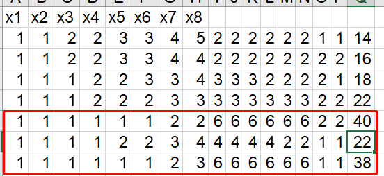

# 📘 Анализ задания №9 ЕГЭ по информатике

## Общая информация

- **Номер задания:** 9  
- **Уровень сложности:** Базовый  
- **Рекомендуемое время:** 5–7 минут  
- **Тип ответа:** Целое число или последовательность цифр  
- **Формат данных:** Таблица (в КИМ — фрагмент электронной таблицы)

---

## Суть задания

Вам даётся **таблица с данными** (обычно 1000+ строк), содержащая несколько столбцов (поля):  
например, *ID, Фамилия, Возраст, Город, Балл, Категория* и т.д.

Требуется:
- **Проанализировать данные**,  
- **Применить фильтрацию по условиям**,  
- **Выполнить агрегацию** (подсчёт, суммирование, поиск максимума/минимума),  
- **Дать числовой ответ**.

> 💡 Это задание проверяет **умение работать с табличными данными**, а не знание формул как таковых.

---

## Проверяемые умения (Кодификатор ЕГЭ)

**2.5. Обработка структурированных данных**

- Чтение и интерпретация табличных данных  
- Фильтрация записей по одному или нескольким условиям  
- Использование логических операций (И, ИЛИ, НЕ)  
- Агрегатные функции: сумма, количество, среднее, максимум, минимум  
- Работа с текстовыми и числовыми данными

---

## Базовая теория для решения

### 1. Логические операции

| Операция | Excel | Python | Пример условия |
|--------|-------|--------|----------------|
| **И** | `И(A2>10; B2="М")` | `and` | Возраст > 10 **и** пол = "М" |
| **ИЛИ** | `ИЛИ(C2="Москва"; C2="СПб")` | `or` | Город = Москва **или** СПб |
| **ИСКЛИЛИ** | `ИСКЛИЛИ(...)` | `!=` для булевых | Только одно из условий истинно |
| **НЕ** | `НЕ(D2="Отказ")` | `not` | Статус **не** "Отказ" |

> 💡 В Python условия пишутся в `if`, `list comprehension` или при фильтрации данных.

---

### 2. Агрегатные функции

| Задача | Excel | Python (наивно) |
|-------|--------|------------------|
| Посчитать строки | `=СЧЁТ(A2:A1001)` | `len(data)` |
| Посчитать по условию | `=СЧЁТЕСЛИ(диапазон; критерий)` | `sum(1 for row in data if условие)` |
| Сумма | `=СУММ(E2:E1001)` | `sum(row[col] for row in data)` |
| Сумма по условию | `=СУММЕСЛИ(диапазон_условия; критерий; диапазон_суммы)` | `sum(row[col_sum] for row in data if row[col_cond] == критерий)` |
| Максимум / Минимум | `=МАКС(...)`, `=МИН(...)` | `max(...)`, `min(...)` |

---

### 3. Условия и ветвления

- В Excel: `=ЕСЛИ(условие; значение_если_истина; значение_если_ложь)`  
- В Python:  
  ```python
  result = value_if_true if condition else value_if_false
  ```

---

## Работа с данными в Excel

### Типичные шаги:
1. Открыть файл с таблицей.
2. Добавить **вспомогательный столбец** с формулой (например, `=ЕСЛИ(И(...); 1; 0)`).
3. Использовать **фильтр** для отбора строк.
4. Применить **агрегатные функции** к отфильтрованным данным.

### Часто используемые функции:
- `СЧЁТЕСЛИ` / `СЧЁТЕСЛИМН` — подсчёт по одному или нескольким условиям  
- `СУММЕСЛИ` / `СУММЕСЛИМН` — суммирование по условиям  
- `ЕСЛИ` + `И` / `ИЛИ` — сложные логические условия  
- `ЛЕВСИМВ`, `ПРАВСИМВ`, `ДЛСТР` — для работы с текстом (редко, но бывает)

> 💡 **СЧЁТЕСЛИМН** и **СУММЕСЛИМН** позволяют задавать **до 127 условий** — очень мощный инструмент.

---

## Работа с данными в Python

Поскольку вы копируете данные из Excel и сохраняете в `.txt`, предполагается **простой текстовый формат** (например, значения через табуляцию или пробел).

### 1. Открытие и чтение файла

```python
with open('data.txt', 'r', encoding='utf-8') as f:
    lines = f.readlines()
```

### 2. Парсинг строк

Если данные разделены **табуляцией** (как при копировании из Excel):

```python
data = []
for line in lines:
    parts = line.strip().split('\t')  # или split() для пробелов
    data.append(parts)
```

> 💡 Первая строка — часто **заголовки**, её можно пропустить: `data = data[1:]`

### 3. Анализ данных

#### Пример: посчитать, сколько строк, где столбец 2 = "М" и столбец 3 > 18

```python
count = 0
for row in 
    if row[1] == "М" and int(row[2]) > 18:
        count += 1
print(count)
```

#### Пример: сумма значений в столбце 4 при условии

```python
total = 0
for row in 
    if row[0] == "Категория А":
        total += int(row[3])
print(total)
```

### 4. Использование списковых включений (list comprehensions)

```python
# Список баллов для Москвы
scores = [int(row[4]) for row in data if row[2] == "Москва"]

# Количество таких записей
count = len(scores)

# Сумма
total = sum(scores)
```

---

## Типичные формулировки задания №9

- «Сколько записей удовлетворяют условию: **пол = "Ж" и возраст > 25**?»  
- «Чему равна **сумма баллов** у участников из школы №5?»  
- «Найдите **максимальный рост** среди юношей ростом не менее 170 см.»  
- «Сколько записей, в которых **хотя бы одно** из полей содержит значение "Да"?»  
- «Определите **средний балл** (целую часть) для категории "Профи".»

---

## Стратегия решения

### В Excel:
1. Проанализируйте структуру таблицы (заголовки, типы данных).
2. Определите, какие столбцы участвуют в условии.
3. Используйте `СЧЁТЕСЛИМН` или `СУММЕСЛИМН` напрямую, **либо**:
   - Создайте вспомогательный столбец с `=ЕСЛИ(ИЛИ(...); 1; "")`
   - Просуммируйте его через `=СУММ(...)`

### В Python:
1. Прочитайте файл.
2. Разбейте на строки и поля.
3. Напишите цикл с условиями.
4. Накапливайте результат (счётчик, сумму и т.д.).
5. Выведите ответ.

---

## Советы

- **В Excel** — всегда проверяйте, включены ли **заголовки** в диапазон (обычно нет!).
- **В Python** — не забывайте **преобразовывать строки в числа** (`int()`, `float()`).
- Если в данных есть **пропуски** — добавьте проверку: `if row[2].strip() != ''`.
- Для **точного соответствия** — учитывайте регистр (`"москва" ≠ "Москва"`).

---

## Пример структуры файла `data.txt`

```
ID	Фамилия	Пол	Возраст	Балл
1	Иванов	М	17	85
2	Петрова	Ж	18	92
3	Сидоров	М	16	78
...
```

Python-код для подсчёта девушек с баллом ≥ 90:

```python
with open('data.txt', 'r', encoding='utf-8') as f:
    lines = f.readlines()[1:]  # пропускаем заголовок

count = 0
for line in lines:
    parts = line.strip().split('\t')
    if parts[2] == 'Ж' and int(parts[4]) >= 90:
        count += 1

print(count)
```

---

> ✅ Задание №9 — одно из самых **предсказуемых** в ЕГЭ. Освоив Excel и базовый Python, вы легко справитесь с любым вариантом.

## Как сохранить данные из файла ods или excel в txt.

1. Откройте файл [9.ods](9_24360.ods)
2. Выберите любую ячейку таблицы с данными


2. Нажмите комбинацию Ctrl+A(для выделения данных в файле)


3. Скопируйте нажав комбинацию Ctrl+C
4. Откройте блокнот


5. Вставьте данные в блокнот 


6. Cохраните файл в папку в которой будет скрипт питона, например под названием data.txt.


# 📘 Разбор №1: (kompege №24360)
(Уровень: Средний)

(А. Ходарин) Откройте файл электронной таблицы, содержащей в каждой строке восемь натуральных чисел. Определите минимальную сумму чисел в строке таблицы, содержащей числа, для которой выполнено ровно одно условие:
– квадрат минимального числа присутствует в строке;
– из чисел строки можно получить три пары одинаковых чисел (например, строку с числами 8 9 6 4 8 9 6 2 можно представить тремя парами одинаковых чисел: 8 8 9 9 6 6, а строку 1 2 7 8 8 2 1 7 можно представить, например, тремя парами одинаковых чисел 1 1 2 2 7 7).

В ответе запишите только число.

Файлы к заданию: [9.ods](9_24360.ods)

# Разбор используя Excel

## 📌 [Видео с разбором задания в Excel](https://drive.google.com/file/d/1YNP_zjMVWWr-sviEWIsOW4Ao7_NQQ3D6/view?usp=sharing)

> Дополнение к видео.
> 
> В видео я разобрал не все возможные варианты комбинации чисел в строке. Поэтому в условии учтены не все случаи
> 
> Правильная формула для ячейки должна быть такой
> **=ЕСЛИ(ИСКЛИЛИ(K2>0;ИЛИ(T2=14;T2=16;T2=18;T2=22;T2=38;T2=40));1;0)**


# 📘 Анализ программного решения задачи №24360  
**Уровень: Средний**

## Условие задачи (кратко)

- В файле — строки по **8 натуральных чисел**.  
- Для каждой строки проверяются **два условия**:  
  1. **Квадрат минимального числа присутствует в строке.**  
  2. **Из чисел строки можно составить три пары одинаковых чисел** (т.е. выбрать 6 чисел, образующих 3 пары).  
- Нужно найти **минимальную сумму** среди строк, для которых **выполнено ровно одно** из условий.

> 💡 Ответ — целое число (минимальная сумма подходящей строки).

---

## 🔍 Программное решение

```python
data_sums = []
for line in open('data.txt'):
    data = [int(x) for x in line.split()]
    f1 = (min(data) ** 2) in data
    counts = [data.count(c) for c in set(data)]
    total_pairs = sum(count // 2 for count in counts)
    f2 = total_pairs >= 3
    if f1 != f2:
        data_sums.append(sum(data))

print(min(data_sums))
```

---

## 📚 Пошаговый разбор кода

### 1. Инициализация списка сумм

```python
data_sums = []
```

- Создаётся пустой список `data_sums` для хранения сумм строк, удовлетворяющих условию «**ровно одно из двух**».

---

### 2. Чтение файла построчно

```python
for line in open('data.txt'):
```

- Открывает файл `data.txt` и читает его **построчно**.  
- Предполагается, что файл содержит **8 натуральных чисел в каждой строке**, разделённых пробелами или табуляцией.

---

### 3. Преобразование строки в список чисел

```python
    data = [int(x) for x in line.split()]
```

- `line.split()` разбивает строку на отдельные элементы (по пробелам/табам).  
- `int(x)` преобразует каждый элемент в целое число.  
- Результат — список `data` из 8 натуральных чисел.

---

### 4. Проверка первого условия

```python
    f1 = (min(data) ** 2) in data
```

- `min(data)` — находит **минимальное число** в строке.  
- `min(data) ** 2` — вычисляет его **квадрат**.  
- Оператор `in` проверяет, **присутствует ли этот квадрат** среди чисел строки.  
- Результат сохраняется в логическую переменную `f1` (`True` или `False`).

---

### 5. Подсчёт частот встречаемости чисел

```python
    counts = [data.count(c) for c in set(data)]
```

- `set(data)` — получает **уникальные числа** из строки.  
- Для каждого уникального числа `c` функция `data.count(c)` считает, **сколько раз оно встречается** в строке.  
- Результат — список `counts`, содержащий **частоты всех уникальных чисел**.

> 💡 Например, для строки `[10, 10, 12, 12, 10, 10, 15, 19]` →  
> `set(data) = {10, 12, 15, 19}` →  
> `counts = [4, 2, 1, 1]`

---

### 6. Расчёт общего количества пар

```python
    total_pairs = sum(count // 2 for count in counts)
```

- Для каждой частоты `count` вычисляется `count // 2` — **максимальное число пар**, которое можно составить из этого числа.  
  - Например: 4 → 2 пары, 2 → 1 пара, 1 → 0 пар.  
- `sum(...)` складывает все возможные пары.  
- Результат — **общее количество пар**, которое можно составить из всей строки.

---

### 7. Проверка второго условия

```python
    f2 = total_pairs >= 3
```

- Проверяет, можно ли составить **хотя бы 3 пары**.  
- Результат сохраняется в логическую переменную `f2`.

---

### 8. Проверка условия «ровно одно истинно»

```python
    if f1 != f2:
        data_sums.append(sum(data))
```

- Оператор `!=` для булевых значений эквивалентен **логическому XOR** («исключающее ИЛИ»).  
- Условие выполняется, если **только одно** из `f1` или `f2` равно `True`.  
- Если условие выполнено, **сумма чисел строки** добавляется в список `data_sums`.

---

### 9. Вывод минимальной суммы

```python
print(min(data_sums))
```

- Находит и выводит **наименьшее значение** среди всех подходящих сумм.  
- Это и есть **ответ на задачу**.

---

## ✅ Корректность решения

Программа **полностью соответствует условию задачи**:

- Корректно проверяет **наличие квадрата минимума**.  
- Правильно считает **максимальное количество пар** (учитывая, что из 4 одинаковых чисел можно сделать 2 пары).  
- Использует **XOR-логику** (`f1 != f2`) для проверки «ровно одного условия».  
- Находит **минимальную сумму** среди всех подходящих строк.

> 📌 **Ответ: 98**


